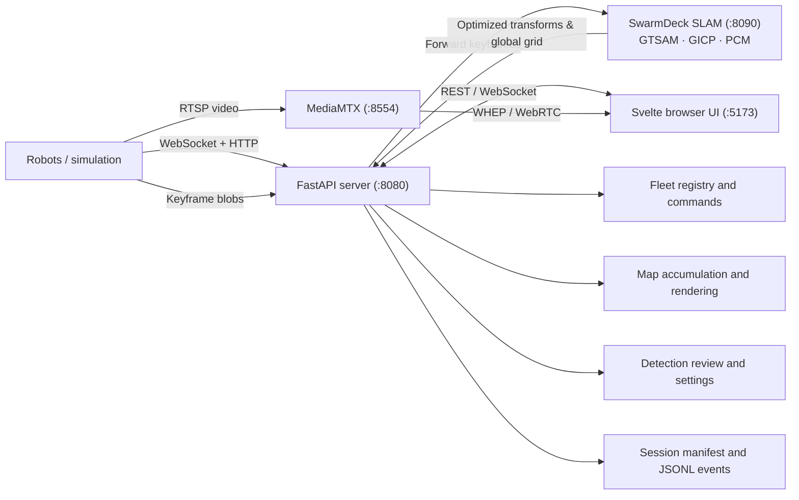

# SwarmDeck

SwarmDeck is a web-based supervision stack for heterogeneous robot fleets. It
combines live robot state, local and merged maps, navigation, teleoperation,
camera streams, detections, and alerts in one browser UI.

The FastAPI backend has no ROS dependency. Each robot connects through the
[adapter protocol](adapters/protocol/README.md), allowing ROS 1, ROS 2, vendor
SDK, Gazebo, and synthetic robots in the same fleet.

## What is implemented

- Dynamic robot registration and capability-driven controls.
- Per-robot local maps plus `graph` (collaborative GTSAM pose-graph optimization), `static`, `auto` (2D grid registration), and optional `cslam` merge modes.
- Collaborative SLAM back-end (`slam/` on port 8090) with Scan Context loop candidate lookup, GICP geometric verification, PCM outlier rejection, and joint trajectory-rendered occupancy grids.
- Navigation goals, cancel, manual drive, stop-all, trails, and planned paths.
- 2D occupancy maps, network-quality heatmaps, and an optional WebGL2 3D cloud.
- WHEP/WebRTC video with a throttled JPEG fallback.
- YOLOE detections, RGB-D map projection, operator review, and persistence.
- Mock, Gazebo, ROS 1, and ROS 2 adapters.
- Session manifests and timestamped JSONL operator events.

MCAP capture, complete session replay, authentication, and production
high-availability are not implemented. See [requirements](docs/architecture/requirements.md)
and the [roadmap](docs/architecture/roadmap.md) for the intended scope.

## Quick start

### Docker simulation

With an NVIDIA container runtime:

```bash
make docker-up-gpu
```

Portable/software rendering:

```bash
docker compose -f deploy/compose/docker-compose.yml \
  --profile gazebo up --build -d
```

Open <http://localhost:5173>. The API is at <http://localhost:8080>; robots can
take about one minute to appear. Stop the stack with `make docker-down`.

Use a synthetic fleet when Gazebo and ROS are unnecessary:

```bash
docker compose -f deploy/compose/docker-compose.yml \
  --profile mock up --build -d
```

Useful commands:

```bash
make docker-logs
make docker-ps
make docker-test
```

### Local development

Requires Python 3.10+, `venv`, Node.js, and npm:

```bash
make install           # ui + server venv
make install-slam      # collaborative SLAM back-end venv (Python 3.12)
make demo              # server + mock fleet + UI
```

> [!IMPORTANT]
> **Python Environment Isolation:** `slam/` is strictly pinned to Python 3.12 and `numpy<2` because `gtsam==4.2.2` segfaults under NumPy 2.x without Python tracebacks. `server/` runs Python 3.13 / NumPy 2.x. Never combine them into a single virtual environment.

For separate terminals, use `make server`, `make slam`, `make mock N=4`, and `make ui`.
The UI-only fallback is <http://localhost:5173/?mock=1&robots=4>.

### Collaborative SLAM

```bash
make up-sim            # Server + UI + SLAM back-end + Gazebo simulation
```

Gazebo adapters stream keyframes to `swarmdeck-slam` on port 8090, which optimizes a joint GTSAM pose graph and renders the merged occupancy grid.

## Physical robots

Set the operator/server address once in [`deploy/fleet.env`](deploy/fleet.env),
then start the operator services and deploy robots:

```bash
make up-deploy
make deploy ROBOT=scout       # scout, botman, aslan, spot, or asimov
make deploy ROBOT=all
```

Deployment performs an SSH preflight, source sync, override generation, image
build, Compose reset/start, and bounded post-start checks. Compose profiles must
have their adapter/media containers running (and healthy when a healthcheck is
defined), with the expected source mount, and the configured adapter must be
registered and reporting live state at `/api/fleet`. Scout additionally verifies
its ROS topics and subscribers before the same backend liveness check. Robot-
specific workspaces, calibration, and safety options remain in
`deploy/robots/<name>.env`.

Read the [hardware procedure](docs/operations/hardware-bringup.md), the
[fleet matrix](docs/robots/fleet.md), and the individual robot page before
operating hardware. A deployment reset removes containers; it does not move the
robot or erase robot-side SLAM.

## Architecture



| Path | Purpose |
|---|---|
| `adapters/` | Protocol adapters, media bridges, and perception sidecar. |
| `adapters/runtime.py` | Shared ROS-independent protocol, sensor, detection, and deadman policy used by hardware bridges. |
| `server/` | ROS-free FastAPI backend (:8080). |
| `slam/` | Collaborative SLAM back-end (:8090, Python 3.12 / GTSAM pose graph optimizer). |
| `server/swarmdeck_server/api/map_routes.py` | Map HTTP transport and upload validation, kept separate from control/websocket handlers. |
| `server/swarmdeck_server/mapsvc/` | Map state, immutable publication snapshots, rendering/output, and collaborative-SLAM collaborators. |
| `ui/` | Svelte 5 dashboard. |
| `ui/src/lib/components/map2d/` | Map interaction in `MapView.svelte`; canvas layers live in `mapLayers.ts`. |
| `swarmdeck_ros/src/` | Gazebo, SLAM, Nav2, and collaborative-SLAM packages. |
| `configs/` | Simulation and backend session configuration. |
| `deploy/` | Docker, operator services, and physical-robot Compose files. |
| `scripts/` | Deployment, bring-up, networking, and utility commands. |
| `sessions/` | Persistent settings, reviewed detections, and session output. |
| `docs/` | [Architecture, robot, and operations documentation](docs/README.md). |

### Mapping and frames

Adapters normally report pose, goals, maps, and clouds in each robot's local
navigation-map frame. The backend converts them to the shared frame used by the
UI.

- `graph`: (default in `4robot.yaml`, `2robot.yaml`, and `hardware_fleet.yaml`)
  trajectory-based collaborative SLAM. Keyframes are sent to `swarmdeck-slam`,
  loops are closed via Scan Context + GICP, pairwise consistent inter-robot
  closures are accepted by PCM (minimum clique size 2), GTSAM optimizes the joint
  graph, and occupancy is rendered from the optimized trajectory. Map and
  trajectory cannot disagree.
- `static`: uses configured start transforms.
- `auto`: (legacy 2D grid stitcher) correlates occupancy grids over SE(2) with
  score and yaw guards. Kept as an independent diagnostic cross-check.
- `cslam`: (legacy Swarm-SLAM / RTAB-Map overlay) consumes an external
  collaborative graph.

Auto-registration needs overlapping observations and may refuse ambiguous maps.
Use the UI's local-map view and `GET /api/map/status` to distinguish a bad local
map from a rejected merge. Details are in [collaborative SLAM plan](docs/architecture/collaborative-mapping-plan.md).

Simulation supports SLAM Toolbox with a planar lidar (`SLAM_BACKEND=toolbox`,
default) or RTAB-Map with a multi-ring lidar:

```bash
SLAM_BACKEND=rtabmap \
SWARMDECK_CONFIG=/app/configs/4robot_3d.yaml \
make docker-up-gpu
```

`GRID_3D=true` retains height in RTAB-Map's cloud but substantially increases
simulation cost. `EXPLORE_SECONDS` controls the mapping bootstrap duration.

### Video and detections

Robots push H.264 to MediaMTX on RTSP port 8554; browsers consume WHEP/WebRTC on
8889. Adapters can also upload JPEG previews at up to 5 Hz. The YOLOE sidecar
returns class, score, box, and optional mask; depth-capable adapters transform
valid detections into map coordinates. Operators accept, ignore, or merge
proposals. See [perception](docs/architecture/perception.md).

### Simulation reset

The UI reset control is shown only when a robot advertises the simulation-only
`reset` capability. It restores simulated poses and clears simulation SLAM,
odometry, goals, costmaps, and backend map state after adapter acknowledgement.
Hardware adapters must never advertise this capability.

## Adding a robot

The backend and UI need no robot-specific code. An adapter must:

1. Connect to `ws://<server>:8080/adapter` and send `hello` with stable identity,
   coordinate frame, footprint, and capabilities.
2. Publish `robot_state` at 5 Hz.
3. Implement only the commands it advertises.
4. Optionally upload maps/scans, clouds, detections, and camera data.

Use `adapters/adapter_mock/mock_adapter.py` as a ROS-free reference. A physical
robot also needs a deployment profile, Compose file, and any sensor calibration;
see [`deploy/robots/README.md`](deploy/robots/README.md).

## Tests

```bash
make test
make docker-test-launch
bash tests/integration/test_sim_headless.sh
```

For manual integration debugging:

```bash
bash tests/integration/run_stack.sh 2
python3 swarmdeck_ros/src/swarmdeck_sim/scenario/explore.py --robots 2 --seconds 240
bash tests/integration/stop_stack.sh
```

## Dependencies and safety

Docker is the supported path. Host simulation development uses ROS 2 Jazzy,
Gazebo Harmonic, Nav2, SLAM Toolbox, `robot_localization`, and optionally
RTAB-Map. ROS 1 Noetic is EOL and must remain in the robot's own environment or
container; the backend does not need a ROS bridge.

`make tunnel` exposes the UI through ngrok or Cloudflare. The generated URL has
no SwarmDeck authentication and therefore must not be placed in front of real
robots without an authenticating proxy.
