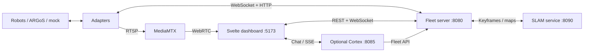

# SwarmDeck

One browser dashboard for a mixed robot fleet. Connect ROS 1, ROS 2, simulated,
or custom robots to view live status, drive and navigate, inspect shared 2D/3D
maps, and review camera feeds and detections. The central server runs without ROS.


## Try it

With Docker, Compose v2, and `make` installed, run from the repository root:

```bash
docker compose -f deploy/compose/docker-compose.yml --profile mock up --build -d
```

Open **[localhost:5173](http://localhost:5173)**. This starts a synthetic fleet;
sensor-based 3D mapping needs a simulator or physical robots.
Use `make docker-down` to stop the stack.

ARGoS is the default simulator. For a sensor-equipped fleet:

```bash
make up-sim                  # software rendering + Fast-LIVO2
# Or: make up-sim RENDER=gpu  # NVIDIA rendering
make down-sim                # stop simulation; keep dashboard services
```

The first simulation build is large. NVIDIA rendering requires the NVIDIA
Container Toolkit. See [simulation setup](docs/architecture/simulation.md)
for other renderers and scenarios, or [hardware bring-up](docs/operations/hardware-bringup.md)
for physical robots.

## Architecture



The UI uses Svelte 5, Canvas 2D, and Three.js. Adapters translate robot-specific
interfaces into a shared protocol. The separate SLAM service aligns robot
trajectories and publishes maps. Cortex is an optional AI assistant.
See the [architecture guide and review](docs/architecture/overview.md) for
component ownership, frame conventions, and maintenance priorities.

## Develop locally

Requires Python 3.10+, Node.js 22.12+, npm, and `make`.

```bash
make install           # server environment + locked UI dependencies
make demo              # server + mock fleet + UI at localhost:5173
```

SLAM uses a separate **Python 3.12 / NumPy < 2** environment because of its GTSAM
binding. Install it with `make install-slam` (requires `uv`), then `make slam`
in another terminal. Cortex setup is in [agent/README.md](agent/README.md).

```bash
make test-server       # server, adapters, and ROS-free scenario/launch checks
make test-ui ui-build  # frontend types, tests, and production build
make install-agent install-slam
make test              # all four suites, including Cortex and SLAM
```

Read [CONTRIBUTING.md](CONTRIBUTING.md) for the development workflow and
[AGENTS.md](AGENTS.md) for coding-agent instructions. `make help` lists commands.

## More information

- [Documentation index](docs/README.md)
- [3D maps, camera colors, and offline Gaussian reconstruction](docs/operations/tactical-3d-map.md)
- [Exploration](docs/operations/mgg-exploration.md) and [physical fleet](docs/robots/fleet.md)
- [Adapter protocol](adapters/protocol/README.md) for adding a robot
- [Known issues](docs/operations/known-issues.md) and [roadmap](docs/architecture/roadmap.md)

SwarmDeck is a research and development system. Authentication and complete
session recording/replay are unfinished; keep robot controls on a trusted
network or behind an authenticating proxy. No project-wide license is currently
declared; bundled third-party components retain their own licenses.
