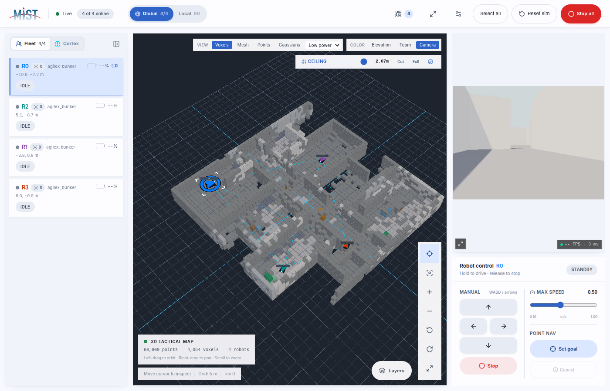
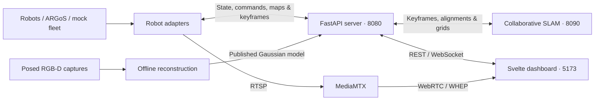

# SwarmDeck

**One dashboard for a heterogeneous robot fleet.**

Supervise robots, inspect their maps, send navigation goals, and review camera
feeds and detections from a browser. SwarmDeck connects ROS 1, ROS 2, simulated,
and custom robots through a common adapter protocol; the central server runs
without ROS.

[Quick start](#quick-start) · [3D mapping](#tactical-3d-mapping) ·
[Physical robots](#physical-robots) · [Documentation](docs/README.md) ·
[Contributing](CONTRIBUTING.md)



*An ARGoS fleet in the tactical view. Geometry comes from robot observations;
camera colors appear where calibrated image observations are available.*

## What you can do

| Capability | What it provides |
| --- | --- |
| Fleet supervision | Live state, capability-aware controls, manual drive, navigation goals, cancel, and stop-all. |
| Collaborative mapping | Local robot maps, shared occupancy grids, pose-graph alignment, and loop-closure verification. |
| Tactical 3D | Voxels, surface mesh, points, and published Gaussian reconstructions, with a ceiling cut and readable robot/path overlays. |
| Video and perception | WebRTC camera feeds, JPEG fallback, RGB-D detection projection, and operator review. |
| Simulation and hardware | ARGoS with RGB-D and LiDAR, a lightweight mock fleet, and deployment profiles for physical robots. |
| Session records | Session manifests, timestamped operator events, and optional keyframe capture for offline analysis. |
| Optional Cortex assistant | An integrated agent service with configurable providers and fleet tools. See [Cortex](agent/README.md). |

## Quick start

### Try the dashboard without robots

Install Docker with Compose v2, then run from the repository root:

```bash
docker compose -f deploy/compose/docker-compose.yml --profile mock up --build -d
```

Open **[localhost:5173](http://localhost:5173)**. This starts a synthetic fleet
without ROS or a simulator. The backend API is at
[localhost:8080](http://localhost:8080). The mock fleet is useful for learning
the controls; real 3D geometry and RGB capture require sensor data.

```bash
make docker-ps       # service status
make docker-logs     # follow logs
make docker-down     # stop the stack
```

### Run a sensor-equipped simulation

Docker, Compose v2, and `make` are required. The first build downloads and builds
the simulator and ROS dependencies and can take considerably longer than startup.
Choose a rendering and odometry configuration:

```bash
# Portable simulation: software Vulkan and synthetic odometry drift
make up-sim RENDER=software ODOMETRY=drift

# NVIDIA rendering with the Fast-LIVO2 odometry front end
make up-argos-gpu

# Intel/AMD rendering with Fast-LIVO2 (requires /dev/dri)
make up-argos-dri
```

The NVIDIA option requires the NVIDIA Container Toolkit. `make up-argos` uses
software rendering with Fast-LIVO2. Synthetic drift is a lighter development
option; it does not reproduce an estimator's sensor-driven failures.

ARGoS supplies Jolt physics and Filament camera/LiDAR rendering. The ROS side
runs the bridge, onboard SLAM, Nav2, and adapters. Allow roughly a minute after
startup for robots to register. Robots start stationary by default; send a goal
or enable exploration in the UI. `EXPLORE=120` on `make up-sim` requests a
120-second autonomous bootstrap.

See [simulation setup](docs/architecture/simulation.md) for scenarios, sensor
configuration, external assets, and the legacy Gazebo Compose profile.
The [simulation performance guide](docs/operations/simulation-performance.md)
covers sensor timestamps, odometry, tuning, measured CPU costs, and regression checks.

## Tactical 3D mapping

The dashboard opens in 3D. Use **Layers → 3D cloud** to switch between the
2D map and tactical view—no `view=3d` URL parameter is needed. Camera position
and display settings survive the switch. Use `?view=2d` to start in 2D.

| View | Representation |
| --- | --- |
| **Voxels** | Instanced occupied cells, coarsened to a bounded rendering budget. |
| **Mesh** | Exposed voxel faces, with internal faces removed. This is a block surface, not a watertight reconstruction. |
| **Points** | Robot point clouds colored by elevation, robot source, or calibrated camera RGB. |
| **Gaussians** | A separately trained, world-aligned reconstruction published to the server. |

Solid robot markers, outlined paths, and selection brackets remain visible over
terrain. Costmaps follow their source robot's map transform. The **Ceiling**
slider clips all four representations to reveal interiors; it changes only the
view, not navigation data.

**Low power** is the default: up to 60,000 points, 8,000 voxels, or 30,000
Gaussians, with a 30 FPS cap and device pixel ratio capped at 1. Geometry and
sorting run in workers; representations and color buffers are reused. Rendering
and map requests pause when the view is hidden. These are workload limits,
not guaranteed frame rates. Balanced and High detail profiles raise the limits.

### Camera colors and Gaussian reconstruction

**Camera** becomes available when the cloud contains RGB. Simulator keyframes
can project synchronized, calibrated RGB-D onto LiDAR samples using the pose at
image capture time and depth for occlusion checks. Unobserved surfaces remain
gray; old XYZ-only keyframes cannot be colored retroactively. Hardware color
projection is an explicit `map_color.enabled` adapter option.

Dense Gaussian reconstruction is an **offline workflow**: capture posed RGB-D,
export a COLMAP dataset, train externally, and publish a compact `.swgs` model.
The optional UMAMI-SLAM integration requires access to the private repository
via `git@github.com:lemonci/UMAMI-SLAM.git` and its CUDA build environment.
UMAMI is not bundled and is not required for the dashboard or other map modes.
The initial Gaussian integration supports global, world-aligned models.

Follow the [3D mapping and reconstruction guide](docs/operations/tactical-3d-map.md)
for controls, quality budgets, calibration, capture, and publishing commands.

## How it fits together



Adapters report data in each robot's local navigation-map frame. The server
aligns that data for the shared view. The tactical scene uses world coordinates
even when displaying one robot; cloud frame metadata prevents double transforms.

The default **graph** mode combines Scan Context candidates, GICP geometric
verification, PCM outlier rejection, and GTSAM pose-graph optimization. By
default, rendering preserves onboard trajectories under their shared alignment
(`odometry_as_pose=true`). A loop closure therefore does not necessarily repair
a bad individual capture. **Static**, legacy **auto** grid registration, and
external **cslam** modes remain available for other deployments and comparisons.

Captures reject duplicate/nonfinite timestamps, excessive turn rates, and
missing historical poses. Bounded TF interpolation pairs scans with capture-time
yaw rather than the latest pose. These checks run before expensive work where
possible; ordinary rejections do not produce recurring debug logs. See
[capture timing and rotated duplicates](docs/operations/keyframe-yaw.md).

## Physical robots

Deployment profiles cover Scout, Botman, Aslan, Spot, and Asimov. Configure the
operator address in [`deploy/fleet.env`](deploy/fleet.env) and each robot's
connection, workspace, and calibration in `deploy/robots/`.

```bash
make up-deploy
make deploy ROBOT=botman DEPLOY_ARGS='--dry-run'  # inspect the deployment
make deploy ROBOT=botman                         # deploy over SSH
```

Start with the [hardware procedure](docs/operations/hardware-bringup.md),
[fleet matrix](docs/robots/fleet.md), and
[deployment profiles](deploy/robots/README.md). Deployment changes remote
containers and services. The UI's simulation reset capability is not advertised
by physical robot adapters.

To add a robot, implement the [adapter protocol](adapters/protocol/README.md):
register identity and capabilities, publish state, and handle the commands you
advertise. The [mock adapter](adapters/adapter_mock/mock_adapter.py) is a
ROS-free reference.

## Development

Use Python 3.10+ for the server, Node.js 22.12+ with npm for the UI, and `make`.
The optional SLAM environment requires **Python 3.12 and NumPy < 2**;
`make install-slam` uses `uv` to create it. Keep server and SLAM environments
separate because the pinned GTSAM binding is incompatible with NumPy 2.

```bash
make install
make demo             # local server + mock adapter + UI

# Optional collaborative SLAM, in another terminal
make install-slam
make slam
```

For separate processes: `make server`, `make mock N=4`, and `make ui`.
The UI-only mock is available at `http://localhost:5173/?mock=1&robots=4`.

```bash
make test-ui          # Svelte checks and 3D map regression tests
make test             # Python suites, SLAM tests, and UI checks/tests
make ui-build         # production frontend build
```

See [Contributing](CONTRIBUTING.md) for focused tests and change guidelines.

| Directory | Responsibility |
| --- | --- |
| [`ui/`](ui/) | Svelte 5 UI, 2D canvas, Three.js tactical view, and rendering workers. |
| [`server/`](server/) | ROS-free API, fleet state, maps, detections, and sessions. |
| [`slam/`](slam/) | Collaborative pose graph, registration, and map rendering. |
| [`adapters/`](adapters/) | Shared protocol, robot bridges, media, and perception. |
| [`swarmdeck_ros/`](swarmdeck_ros/) | ROS simulation, SLAM, navigation, and bring-up packages. |
| [`agent/`](agent/) | Optional Cortex assistant service. |
| [`configs/`](configs/) · [`deploy/`](deploy/) | Session configuration, containers, and hardware profiles. |
| [`scripts/`](scripts/) · [`docs/`](docs/README.md) | Operations tools and detailed documentation. |

## Project status

SwarmDeck is a research and development system. Authentication, production high
availability, MCAP capture, and complete session replay are not implemented.
Use a trusted network or an authenticating proxy; do not expose robot controls
directly to the public Internet. See [known issues](docs/operations/known-issues.md)
and the [roadmap](docs/architecture/roadmap.md).

The repository does not currently declare a project-wide license. Bundled
third-party components retain their own licenses.
