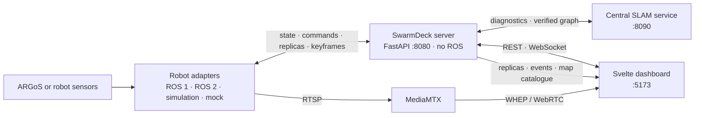

# SwarmDeck

SwarmDeck is a browser dashboard for supervising a heterogeneous robot fleet.
It combines robot adapters, collaborative mapping, navigation, video, and
operator review behind one ROS-free server. ARGoS simulation and physical
robot adapters use the same protocol, so a fleet can be inspected and
commanded from the same UI.

[Quick start](#quick-start) · [Architecture](#architecture) ·
[3D map](#3d-map) · [Physical robots](#physical-robots) ·
[Plan](docs/plan.md) · [Documentation](docs/README.md) ·
[Contributing](CONTRIBUTING.md)


## Quick start

The commands below run from the repository root. Docker with Compose v2 and
Python 3.10+ are required for the launcher and container workflows; `make
install` also requires Node.js for the host development workflow.

### Dashboard with a mock fleet

This is the smallest way to try the UI. It runs the server, UI, SLAM service,
MediaMTX, and a synthetic fleet without ROS or a simulator.

```bash
docker compose -f deploy/compose/docker-compose.yml --profile mock up --build -d
```

Open <http://localhost:5173>. The API is at <http://localhost:8080> and SLAM
diagnostics are at <http://localhost:8090/status>.

```bash
make docker-ps
make docker-logs
make docker-down
```

### ARGoS simulation

The supported launcher starts the peer Swarm-SLAM, native MOLA, indexed-query,
MGG, and ARGoS services as one mission. Synthetic drift is the fastest way to
exercise the complete data path; it does not test a sensor-driven odometry
estimator.

```bash
./scripts/sim-up --drift
```

Other simulation configurations are available when validating mapping,
rendering, or sensor timing:

```bash
./scripts/sim-up --scenario bistro --drift
./scripts/sim-up --dev                 # 3 robots, DRI rendering, drift
./scripts/sim-up --gpu --fast-livo2    # estimator-backed NVIDIA run
./scripts/sim-up --legacy-cloud --drift # explicit legacy central-cloud path
./scripts/sim-up --status
./scripts/sim-up --down
```

`make up-sim` remains a compatibility wrapper; its `SCENARIO`, `RENDER`,
`ODOMETRY`, `TARGETS`, and `EXPLORE` variables are passed to the same launcher.
A fresh mission UUID and ROS domain are selected for each MOLA run, and the
reset supervisor keeps the stack lifecycle consistent. The normal launcher
uses MOLA; the old cloud/OctoMap path is available only through
`--legacy-cloud`. See [simulation](docs/architecture/simulation.md) and
[simulation performance](docs/operations/simulation-performance.md) for
sensor, rendering, and timing tradeoffs.

### Host development

```bash
make install
make demo                         # server + mock adapter + UI
make test-ui
make test
```

The optional collaborative SLAM environment is separate because its pinned
GTSAM binding requires Python 3.12 and NumPy < 2:

```bash
make install-slam
make slam
```

## Architecture

The normal stack keeps ROS at the adapter and simulation boundaries. In the
simulation and onboard planning path, each robot participates in peer
Swarm-SLAM; coherent products are consumed by native MOLA and queried by MGG.
The server owns fleet state, sessions, replicas, and operator APIs; the browser
receives REST and WebSocket state and obtains camera media from MediaMTX.



The central server path remains available for diagnostics, historical maps, and
the explicit legacy mode. The normal simulation launcher selects the onboard
authority chain: sensors, capture, peer Swarm-SLAM, native MOLA, indexed query,
MGG, Nav2, adapter. [`docs/plan.md`](docs/plan.md) owns that chain, its
ownership table and its invariants. Use [current stack
operations](docs/operations/current-stack.md) for commands and the [acceptance
log](docs/operations/acceptance-log.md) for measured trials.

## 3D map

Open **Layers → 3D cloud** in the dashboard. The viewer supports bounded voxel,
mesh, point, and published Gaussian representations, plus robot and path
overlays. Camera colors require synchronized images together with camera/lidar
calibration and capture-time poses; RGB-D depth can improve correspondence and
occlusion handling, but is not required for every colorized capture. Old
XYZ-only captures cannot be colored retroactively. Gaussian reconstruction is
an optional offline workflow consuming fixed, qualified poses and a model
published for the selected component or legacy world frame. Selecting the
Gaussian layer does not start a trainer.

Maps from separate robots are combined only when their shared component and
transforms are verified. Local or unmerged components remain separate. The
viewer reuses geometry across pose-only revisions and preserves the current
camera while a live map refreshes. Route geometry is rendered in metric XYZ
with bounded sampling and both endpoints retained. The top-down 2D view keeps
the selected map-frame transform and uses XY for display, so a path does not
slide or acquire visually exaggerated Z jumps when a new revision arrives.

## Physical robots

Deployment profiles cover the Scout/TARS, Botman, Aslan, Spot, and Asimov
platforms. The operator stack runs on the workstation and robot services run on
the robots; sensor drivers, localization, calibration, and Nav2 therefore stay
platform-specific.

```bash
make up-deploy
make deploy ROBOT=botman DEPLOY_ARGS='--dry-run'
make deploy ROBOT=botman
```

Set `BACKEND_HOST` in [`deploy/fleet.env`](deploy/fleet.env) and review the
profile under [`deploy/robots/`](deploy/robots/). Start with [hardware
bring-up](docs/operations/hardware-bringup.md) and the [fleet
matrix](docs/robots/fleet.md). Deployment changes remote containers and
services; use an authenticating proxy before exposing operator controls beyond
the trusted network.

## Repository map

| Directory | Responsibility |
| --- | --- |
| [`ui/`](ui/) | Svelte dashboard, 2D map, WebGL2 tactical view, and workers |
| [`server/`](server/) | ROS-free API, fleet state, sessions, maps, and replicas |
| [`slam/`](slam/) | Collaborative pose graph, registration, and map rendering |
| [`adapters/`](adapters/) | Wire protocol, robot bridges, media, and perception |
| [`autonomy/`](autonomy/) | Capture, peer coordination, mapping products, and replication contracts |
| [`swarmdeck_ros/`](swarmdeck_ros/) | ROS simulation, mapping, navigation, and bring-up packages |
| [`configs/`](configs/) · [`deploy/`](deploy/) | Session configs, Compose files, and robot profiles |
| [`scripts/`](scripts/) · [`docs/`](docs/README.md) | Operations tools, the plan, and detailed guides |

## Current validation and limits

SwarmDeck is a research and development system. The mock fleet and ARGoS
integration paths are useful for development, while physical robot behavior
still depends on each platform's sensors, localization, network, and safety
checks. The current onboard mapping trials validate contracts, native MOLA
serialization, bounded indexed queries, and selected simulation scenarios;
they do not qualify every robot, terrain, failure mode, or resource budget.
The Bistro curb and long-range navigation behavior remain under investigation,
and fleet-wide exploration is not yet a qualified acceptance result.

The simulation terrain-step limits are 0.15 m for Bunker and Scout and 0.30 m
for Spot. These are simulation settings, not hardware guarantees. Gaussian
quality and resource scaling, multi-host recovery, and fleet-wide autonomy
remain acceptance work. Every measured trial is in the [acceptance
log](docs/operations/acceptance-log.md); exact old settings and the debugging
chronology stay in [the archive](docs/archive/README.md).

Authentication, production high availability, MCAP capture, and complete
session replay are not implemented. Do not expose robot controls directly to
the public Internet. The repository does not currently declare a project-wide
license; bundled third-party components retain their own licenses.
