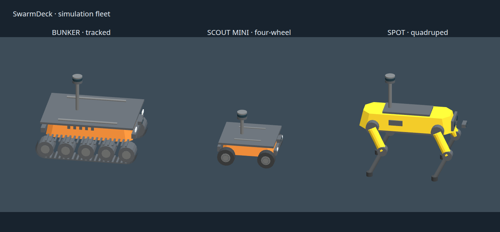

# Simulation robot visuals



Original procedural approximations for SwarmDeck's sensor-equipped fleet:

- **Bunker:** orange bevelled hull, capsule tracks, exposed rollers, tread bars,
  bumpers, lamps, ventilation slots, and payload rails.
- **Scout Mini:** compact orange chassis, four rubber wheels with alloy hubs,
  bumpers, lamps, and mounting rails.
- **Spot:** yellow shell, dark sensor face, hip and knee joints, angled leg
  segments, rubber feet, and payload plate.

Visual references: [AgileX product manuals](https://github.com/agilexrobotics/AgileX-Robotics-all-products-user-manuals),
[Scout Mini](https://global.agilex.ai/products/scout-mini), and
[Spot anatomy](https://support.bostondynamics.com/articles/Knowledge/Spot-Anatomy-49915).
These are original geometry, not manufacturer CAD or downloaded product meshes.
The models approximate appearance; they do not claim mechanical fidelity.

Regenerate from the repository root using only the Python standard library:

```sh
python3 swarmdeck_ros/src/swarmdeck_sim/scenario/make_robot_visuals.py
```

The shared GLB writer merges parts by material: Bunker has 2,816 triangles in
six batches, Scout Mini 2,176 in six, and Spot 1,672 in five. No textures,
external buffers, skeletal animations, or extra runtime libraries are needed.
Committed GLBs are copied into the ARGoS image by the existing asset COPY step.
Generated scenarios select this directory through `photorealism.asset_path`;
installed assets remain the fallback for other robot types.

Models are authored in metres with +X forward and +Z up, exported Y-up, then
rotated once by their `.visual.xml` descriptors. Origins are at the ground
anchor. Mapping LiDAR centres follow the existing entity mounts: Bunker
`(-0.15, 0, 0.72)`, Scout Mini `(-0.08, 0, 0.4525)`, Spot `(-0.18, 0, 0.97)`.
These descriptors preserve the existing segmentation class IDs.

These visuals affect cameras and rendered LiDAR. They do not change collision
bodies, footprints, odometry, or sensor calibration. Spot's legs are static
visual geometry; the simulator still uses its simplified rigid-body drive model.
Dashboard tactical markers remain the filled, team-coloured symbols.
