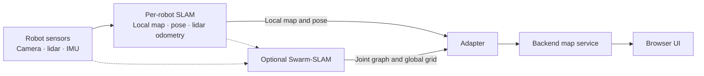

# Mapping and collaborative SLAM

SwarmDeck supports independent per-robot SLAM, backend map registration, and an
experimental Swarm-SLAM integration. These solve different problems.

## Current mapping paths

### Per-robot SLAM

- `SLAM_BACKEND=toolbox` uses a planar scan and SLAM Toolbox. Wheel odometry and
  gyro data feed a `robot_localization` EKF; SLAM Toolbox publishes the local
  `map → odom` correction.
- `SLAM_BACKEND=rtabmap` uses registered 3D points through RTAB-Map
  `icp_odometry`, then publishes a pose graph and 2D occupancy grid. A multi-ring
  lidar profile is required. `GRID_3D=true` also retains height for the optional
  3D viewer, at a substantial simulation-performance cost.

Both paths publish a local occupancy grid under the same adapter interface, so
the backend, UI, and navigation commands do not depend on the SLAM package.

Lidar ring counts must be one or odd. Gazebo distributes vertical samples over
an inclusive angle range; an even count has no horizontal ring and causes a
height-filtered 2D scan to lose distant returns.

### Backend map registration

The default backend is a map stitcher, not collaborative SLAM. Each robot first
corrects its own trajectory. The map service then aligns completed local grids
in SE(2):

- `static` applies configured transforms.
- `auto` correlates signed occupied/free grids over a coarse-to-fine yaw search.
  It checks score, rival translation, rival yaw, shared support, and optional
  start-pose priors before accepting a transform.

Known-free cells are important: walls alone can make rotated symmetric layouts
look identical. Registrations run outside the asyncio event loop and refine
accepted transforms in a narrow search window.

Auto mode requires overlapping mapped space. Repetitive or nearly disjoint maps
may be refused; this is safer than overlaying a confident guess. Inspect the
local-map view and `GET /api/map/status` for the exact rejection reason. Use
`static` mode when reliable start transforms are available.

Backend registration never updates a robot's pose graph, so one robot cannot
correct another robot's drift.

## Swarm-SLAM integration

`make docker-up-cslam` adds MISTLab Swarm-SLAM to the Gazebo/RTAB-Map stack.
Swarm-SLAM exchanges descriptors, geometrically verifies inter-robot loop
closures, and optimizes a joint GTSAM graph. `swarmdeck_cslam/graph_reporter`
publishes a compact JSON summary that `adapter_sim` forwards as the optional
`slam_graph` protocol message.

With `map.merge_mode: cslam`, robots join the merged map only when they share the
majority collaborative frame. Disconnected robot groups remain separate rather
than being overlaid at an assumed identity. Grid registration is retained as an
independent diagnostic check but does not set the transform.

This path is experimental. It has produced verified inter-robot closures, but
the RTAB-Map grids and Swarm-SLAM trajectories are generated by separate SLAM
systems and can disagree by metres. Measurements in this repository showed
`cslam` transforms 11–16 m from ground truth while grid registration was
0.03–0.20 m away. Do not use `cslam` merge mode for physical navigation until
both map and transform come from one consistent trajectory estimate.

## Sensor and odometry choices

| Option | IMU requirement | Role |
|---|---|---|
| SLAM Toolbox | optional gyro | Planar SLAM and loop closure. |
| RTAB-Map | optional | 3D ICP odometry, pose graph, 2D grid, optional visual closure. |
| KISS-ICP | none | Lidar odometry only. |
| FAST-LIO2 / Point-LIO | synchronized high-rate IMU | Lidar-inertial odometry; needs a loop-closure layer. |
| GLIM / LIO-SAM | synchronized high-rate IMU | Full 3D SLAM with greater hardware and calibration demands. |

Lidar-inertial systems normally need a correctly oriented, synchronized IMU at
roughly 100–400 Hz. Confirm timestamps, rate, axes, and extrinsics on hardware
before selecting one.

DLIO is available as a Compose overlay for hardware evaluation. It performs
poorly in the current Gazebo comparison because simulated clouds lack per-point
timestamps, disabling its central de-skewing advantage; that result should not
be treated as a hardware benchmark.

## Remaining limits

- `auto` registration is pairwise against one reference and has no transform
  loop-consistency optimization or reference re-election.
- Near-disjoint coverage is fundamentally ambiguous; priors or collaborative
  loop closures are required for reliable alignment.
- The normal merged map is a rendering product, not a feedback correction to
  each robot's SLAM trajectory.
- A production collaborative path must use one consistent optimized trajectory
  for both the occupancy grids and inter-robot transforms.
