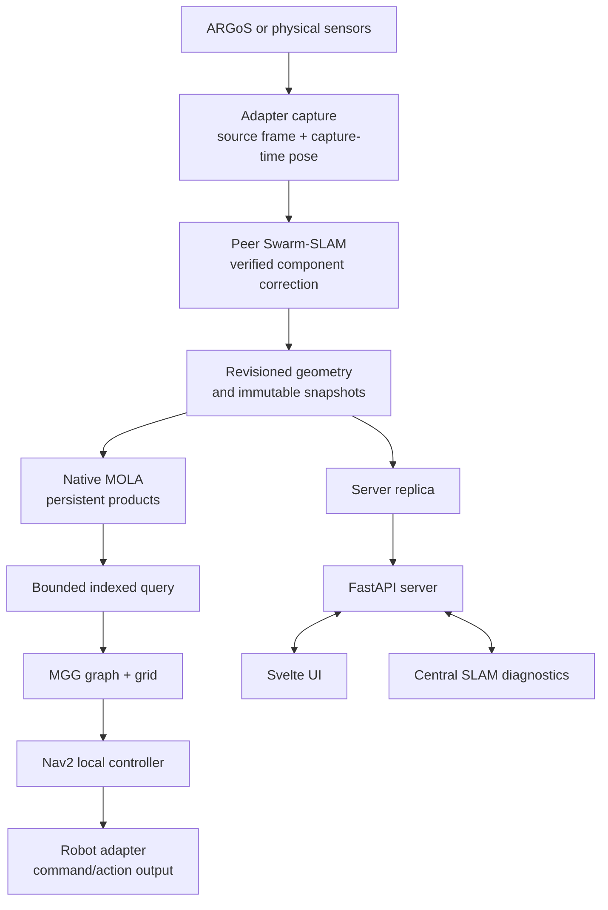

# Current stack

This page describes the interfaces that are current on `planning-refactor`.
Long acceptance notes and old run settings remain in the linked operation and
architecture pages; this page is the short orientation for maintainers.

The normal ARGoS launcher composes the peer, mapping, and onboard-planning
services and selects MOLA as MGG's map authority. The explicit
`--legacy-cloud` launcher mode retains the former central cloud/OctoMap path
for comparison and recovery. MOLA consumes the peer snapshot and does not
optimize poses or publish competing TF edges. MGG consumes an exact,
mission-pinned map authority. A missing or stale shared transform blocks the
dependent operation rather than assuming that two local frames coincide.

## Frames and ownership

Adapters capture points in a sensor frame and associate them with a pose at the
capture timestamp. The local odometry and navigation frames remain robot-owned.
Peer Swarm-SLAM can establish a verified component frame and correction. The
same correction identity and map revision flow into the MOLA product and
indexed query. MGG plans in the configured robot navigation frame; Nav2 handles
local obstacle avoidance and the adapter owns the final command boundary.

The server stores replicas, events, keyframes, and catalogue metadata for the
operator. It receives peer and MOLA revisions as replicas without becoming the
authority for an onboard planner. Browser overlays are therefore diagnostic
unless their component and frame metadata are valid.

The UI keeps map transforms when a raster grows, rejects stale or malformed
patches, projects poses with their full SE(3) XYZ values in 3D, and samples
rendered routes to at most 1,024 points while preserving both endpoints. The
top-down 2D layer keeps the selected map-frame transform and uses XY for
display, so a path does not slide or acquire visually exaggerated Z jumps when
a new revision arrives.

## Main components

| Area | Source | Responsibility |
| --- | --- | --- |
| Server | `server/` | ROS-free API, fleet state, sessions, replicas, operator commands |
| UI | `ui/` | 2D map, tactical 3D view, camera playback, controls |
| Central SLAM | `slam/` | Server-facing pose graph and occupancy products |
| Adapters | `adapters/` | ROS 1/ROS 2/ARGoS/mock protocol boundary and keyframe capture |
| Peer mapping | `autonomy/`, `deploy/autonomy/` | Snapshot contracts, coordination, indexed map queries |
| Native mapping | `swarmdeck_ros/src/swarmdeck_mapping/` | Persistent MOLA runtime and product serialization |
| Planning | `deploy/mgg/` | MGG graph/grid planning and local-controller integration |

The simulation terrain admission settings are 0.15 m for Bunker and Scout and
0.30 m for Spot. These are simulator parameters, not hardware guarantees.
Camera-colorized point clouds require synchronized images, camera/lidar
calibration, and capture-time poses; RGB-D depth is useful for correspondence
and occlusion handling but is not required for every colorized capture.
Gaussian splatting is an optional fixed-pose reconstruction workflow and is not
launched merely by selecting a UI layer. MGG consumes a read-only OctoMap
spatial index produced from MOLA's coherent output; independent raw-cloud
mapping is disabled in MOLA mode.
