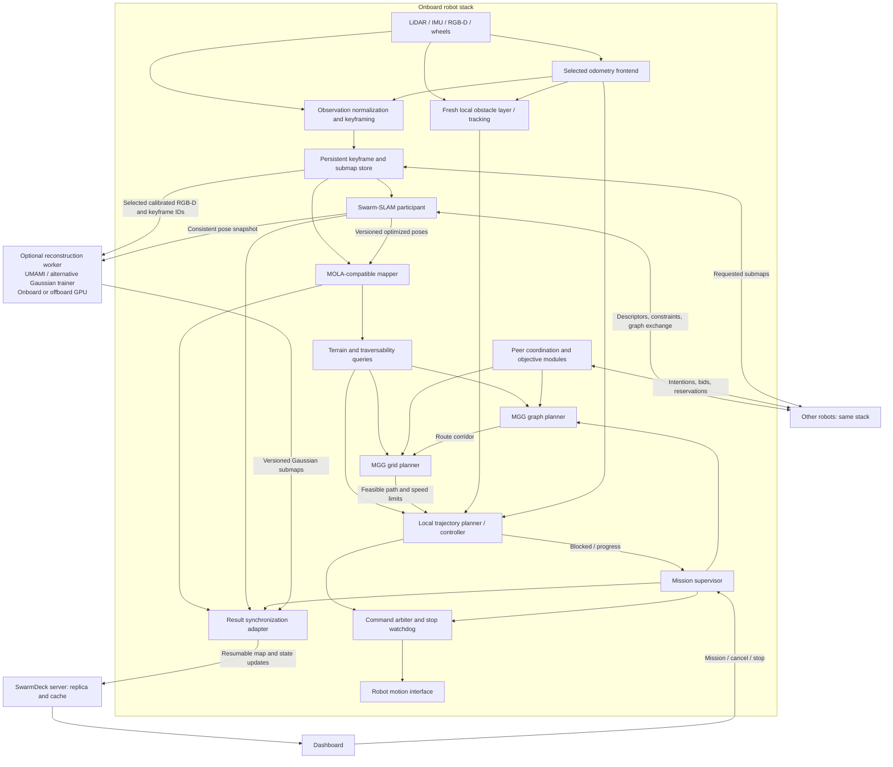

# Decentralized autonomy integration plan

Status: **implementation in progress on `planning-refactor`**. Reviewed 2026-09-09.
See the [implementation and validation record](../operations/decentralized-autonomy.md)
for enabled paths, reproducible commands, and outstanding acceptance gates.

## 1. Outcome and scope

Run odometry, collaborative SLAM, mapping, planning, and control onboard each
robot. Robots collaborate directly when connected. SwarmDeck receives replicated
results for supervision and visualization; it is not required to compute their
maps or routes. Use the same interfaces in simulation and on ROS 2 hardware.

The planning hierarchy is **graph planner → grid planner → local trajectory
planner/controller**. Exploration and coordination influence planning objectives;
collision, terrain feasibility, and actuator limits remain hard constraints.

Initial scope: LiDAR/RGB-D ground robots, existing SuperOdometry and Fast-LIVO2
frontends, MOLA mapping infrastructure, actual MISTLab Swarm-SLAM, and refactored
MGG. ROS 1 Scout control remains behind an adapter. Include Gaussian reconstruction
as a first-class optional map product, with UMAMI-SLAM as an initial backend and
a replaceable reconstruction interface. Training stays asynchronous and outside
the navigation loop; an unavailable GPU must not interrupt mapping or control.

This plan does not authorize deployment changes or robot motion. Implementation
should proceed through the acceptance gates below, with the current stack
available as a rollback option.

## 2. Baseline and integration boundaries

The current default runs one central SwarmDeck graph optimizer. Adapters send
keyframes to the server, which forwards them to that optimizer. Robots can pull
2D navigation maps back from the server. MGG runs per robot, maintains its own
OctoMap, and sends paths through PCI; SwarmDeck currently forwards only the final
pose to navigation. In simulation, NavFn replans that goal and DWB controls motion.
Peer MGG graph exchange is not connected. Adapter disconnect handling currently
cancels exploration and navigation.

MOLA supplies modular C++ interfaces, a YAML launcher, ROS 2 bridges, and metric
map types. Its `SharedKeyframeMap` interface accepts keyframe insertions, while
`MapSourceBase` exposes map products. These are useful building blocks, not an
existing Swarm-SLAM connector. See [MOLA modules](https://docs.mola-slam.org/latest/modules.html)
and [SharedKeyframeMap](https://docs.mola-slam.org/latest/class_mola_SharedKeyframeMap.html).

The stock `mola_mapper` includes its own iSAM2 optimizer and is documented as
under development. Do not assume it can be configured as a passive renderer of
Swarm-SLAM solutions. Initially implement a MOLA-compatible mapping module using
MOLA interfaces/map libraries, with Swarm-SLAM as the collaborative pose authority.
Evaluate reuse of stock Mapper only if a supported external-solution interface
can preserve that authority. [Mapper status](https://docs.mola-slam.org/latest/mola_mapper.html)

Swarm-SLAM supplies decentralized collaboration, including loop-closure discovery
and verification. Audit the pinned backend's optimizer election and recovery:
peer-to-peer operation means no fixed server dependency, not necessarily that
every optimization is distributed across all peers. An elected robot may perform
a solve. Test its loss explicitly. [Swarm-SLAM](https://github.com/MISTLab/Swarm-SLAM)

## 3. Component architecture

Every robot runs the onboard block. Arrows describe logical contracts, not a
requirement to put every component in its own process.

### Ownership

| Concern | Authority |
|---|---|
| Continuous local motion estimate | One selected frontend per robot/session |
| Collaborative keyframe poses and component membership | Swarm-SLAM solution adapter |
| Occupancy, surface geometry, map revisions | Onboard mapper |
| Robot feasibility | Shared traversal model, used by both planners and controller |
| Exploration route and navigation goals | MGG planning hierarchy |
| Actuator commands and cancellation | Onboard command arbiter |
| Gaussian appearance and model checkpoints | Optional reconstruction worker, bound to a graph revision |
| Browser display | SwarmDeck's cached replica |

Do not run MOLA's optimizer and Swarm-SLAM as competing publishers of the same
correction. Do not treat multiple estimators consuming the same IMU/LiDAR as
independent measurements. Initially select one frontend; multi-estimator fusion
requires an explicit treatment of correlated information.

## 4. Data contracts and frames

Define transport-independent contracts first, with ROS 2 messages/actions onboard
and a versioned binary/HTTP protocol for server replication. Keep MRPT, GTSAM,
MOLA, and ROS implementation types out of the dashboard protocol.

| Contract | Required content |
|---|---|
| Observation/keyframe | Robot ID, session UUID, sequence, capture interval, sensor frame, calibration version, local pose, uncertainty, deskew status, payload reference |
| Relative constraint | Endpoint IDs, relative SE(3), covariance/information convention, provenance and unique constraint ID |
| Graph solution | Component ID, anchor identity, solution epoch/revision, membership, pose updates, superseded/retracted constraints |
| Map manifest | Map/layer ID, frame, graph revision, geometry revision, immutable chunk hashes, replacements/tombstones, bounds and resolution |
| Reconstruction job | Backend/version, input keyframe and calibration IDs, component/submap ID, graph snapshot, training budget, checkpoint and state |
| Gaussian artifact | Source observations, graph/geometry revisions, local frame, encoding, bounds, quality level, immutable chunk hashes |
| Planning request | Mission ID, task type, goal/reference, component and map revisions, robot capability profile, deadline |
| Planned route/path | Route ID, parent mission, corridor or poses, frame/revisions, clearance and speed constraints, validity conditions |
| Peer intention | Robot/session, route or target, frame/revision, reservation lease, priority and expiry |
| Execution feedback | Accepted/rejected, active/waiting/blocked/succeeded/canceled/failed, progress, reason, input freshness |

Use stable string robot IDs at the SwarmDeck boundary and a persistent mapping to
Swarm-SLAM integer IDs. Restarted estimators create new session IDs; sequence
numbers must never accidentally connect different trajectories. Never feed a
peer constraint back as a new independent observation.

The proposed TF tree is `component_map → robot_map → odom → base_link → sensors`.
Publish only edges with established meaning. A disconnected robot has its own
map root; no identity transform connects unrelated maps. The frontend owns
`odom → base_link`; one solution/frame adapter owns the correction edges. Factor
the correction consistently rather than applying the same correction twice.
Use per-keyframe solutions to reconstruct geometry: a single map transform
cannot repair internal trajectory deformation.

MOLA external odometry should enter through full 3D `nav_msgs/Odometry`. Its
Smoother and Simple configurations differ in TF ownership, so disable conflicting
bridge TF outputs in this design. Preserve capture-time transforms and sensor
origins. [MOLA ROS 2 configuration](https://docs.mola-slam.org/latest/mola_ros2_configurations.html)

Plans reference map revisions. A gauge/anchor change re-expresses an unchanged
physical route; a geometric correction requires route revalidation. The local
controller operates in continuous odometry coordinates. If a correction makes
its route ambiguous or invalid, hold safely and replan instead of jumping the
tracking target. Store home/goals against stable map landmarks or keyframes so
optimization can update their coordinates. Persist home across process restarts
within the same mission; resetting the estimator must not silently redefine home.

Within a robot, synchronize sensors and preserve source timestamps. Across robots,
measure clock offset/uncertainty; use monotonic local timers for watchdogs and
receipt-relative leases. Do not assume ROS simulation time, hardware time, and
server wall time are interchangeable.

## 5. Mapping and dynamic environments

Maintain three products with different lifetimes:

1. **Persistent reconstruction:** colored keyframe clouds and submaps. Keep local
   geometry plus poses; avoid repeatedly baking all points into world coordinates.
2. **Planning map:** observed free/occupied/unknown volume, surfaces, traversability,
   and uncertainty. Retain sensor origins for free-space raycasting. Use layered
   elevation or full 3D where bridges, stairs, or stacked floors require it.
3. **Local dynamic layer:** recent obstacles, observed clearing, timestamps, and
   eventually tracked objects with motion uncertainty. It must remain usable if
   global mapping or peer communication stalls.

After a graph update, rigidly move unchanged submaps and rebuild only those whose
internal poses changed. Replace affected occupancy contributions rather than
adding corrected observations on top of old ones. Revision-tag derived terrain,
clearance fields, and UI tiles; publish coherent manifests atomically.

Terrain queries return ground height/normal, step/drop estimates, roughness,
clearance, support confidence, and observation age. Profiles define robot body
geometry, slope limits, step ascent/descent limits, turning constraints, and
speed. The simulated 10 cm / 30 cm step limits are scenario settings, not proof
of hardware performance. Spot's legged locomotion remains the responsibility of
its onboard controller; MGG must respect its supported commands and constraints.

Occupied points alone cannot certify free space. Unknown ground and missing
returns cannot be treated as traversable. Obstacle expiry alone cannot prove an
area clear; use visibility and fresh observations. Start with reactive dynamic
avoidance, then add predicted trajectories and uncertainty where measurements
justify them. Moving objects should not become permanent walls or loop-closure
features merely because they were observed once.

### 5.1. Gaussian reconstruction and UMAMI-SLAM

Treat reconstruction as another consumer of calibrated observations and corrected
poses, alongside the occupancy mapper. It must not become a second pose authority.
Default to fixed externally supplied camera poses. If a trainer refines poses
internally, record those as reconstruction-local parameters; never silently
publish them into TF, Swarm-SLAM, or navigation. Adding UMAMI as an alternative
odometry frontend would be a separate integration with separate validation.

The pinned `train_colmap` path constructs its Gaussian mapper without an
ORB-SLAM3 tracking system and reads the supplied camera poses. LiDAR odometry
and Swarm-SLAM remain the pose providers. ORB-SLAM3 is still linked by the
upstream libraries; extracting a standalone Gaussian backend would remove
that dependency without adding another tracker.

**Reuse the existing implementation.** `scripts/reconstruction/capture_rgbd.py`
records aligned RGB-D and capture-time camera poses; `scripts/reconstruction/umami.py`
exports COLMAP data, invokes the headless trainer, and converts Gaussian PLY to
SwarmDeck's compact `.swgs` format. The existing route/viewer supports published
global Gaussian models. The documented UMAMI inspection targets private commit
`b1251d435b09f4298a414dbc1151c9bae42c3c37`, specifically `train_colmap.cpp` and
`gaussian_model.cpp`; its copied Photo-SLAM README is not the integration contract.
Recheck the pinned executable and supported configuration during phase 0 rather
than assuming incremental training or pose-update APIs exist. See the
[existing reconstruction workflow](../operations/tactical-3d-map.md#capture-rgb-d-and-reconstruct-with-umami-slam).

**Backend interface.** Define job operations for validate, prepare, run, cancel,
query status, and export. Checkpoint/resume, external-pose constraints, incremental
updates, and depth losses are declared capabilities, not mandatory assumptions.
Initially support an offline batch backend using the existing exporter/trainer;
add incremental submap training only after proving backend support. Report
queued, waiting-for-input, training, ready, stale, canceled, and failed states.
Bind retries and outputs to an immutable input snapshot so late jobs cannot
replace a newer model. Keep jobs resumable through a durable journal; a backend
without checkpoints restarts its bounded submap job.

**Observation contract.** Extend capture metadata with robot/session/keyframe ID,
submap ID, RGB and depth timestamps, optical-frame convention, intrinsics,
distortion/rectification model, RGB-depth and camera-body extrinsics, calibration
version, depth units, validity masks, and exposure metadata when available. Do
not save only a baked `T_world_camera`: retain the keyframe-to-camera transform
so a later graph solution can produce a new consistent training pose snapshot.
Select frames for viewpoint diversity and usable geometry/appearance, rather
than duplicating the high-rate stream. Keep an explicit relation between RGB-D
captures and SLAM keyframes even when their sampling rates differ.

Depth is a metric geometric prior where supported. The current COLMAP path uses
it to seed points; that does not establish that the trainer applies a depth loss.
A LiDAR-seeded RGB alternative is possible after separate calibration/occlusion
validation. Missing color/depth should degrade to geometric maps, not fabricate
texture or assert successful reconstruction. Mask moving people, robots, and
transient objects using available temporal/geometric evidence; record uncertainty
when a mask is incomplete. Calibrated point-cloud colorization remains available
independently of Gaussian training.

**Submaps and loop corrections.** Train bounded Gaussian submaps in their own
local coordinates. For a rigid graph correction, update the submap transform;
rotate anisotropic Gaussian covariance/orientation and account for view-dependent
appearance conventions. Keeping model and viewing direction in the same local
frame avoids incorrectly leaving appearance tied to old world axes. Internal
keyframe deformation requires invalidating and retraining/refining the affected
submap; translating an entire splat model is insufficient. Start with retraining
as the correct baseline. Handle seams and overlap between independently trained
submaps without duplicating opacity. Never train disconnected robot maps into
one assumed global frame. A component merge can align separate artifacts first;
joint photometric refinement is optional later work.

**Placement and scheduling.** Support three explicit modes: off; deferred batch
on a GPU workstation; bounded onboard incremental reconstruction on capable
hardware. Capture remains onboard in all enabled modes. Offboard jobs use
selective, resumable upload of RGB-D input, with configurable retention and link
budgets; this is a new optional image-transfer path, unlike point colorization
which can keep camera images local. Do not require the dashboard host to have
CUDA. An optional GPU worker may share its machine, but remains a separate
service. Peer mapping and exploration continue if that worker or server is lost.

Enforce caps on selected frames, input resolution, splat count, GPU memory,
training time, disk, and upload bandwidth. Yield or pause reconstruction before
it competes with control, odometry, or sensor processing. Record training backend,
source revision, configuration, and input manifest for reproducibility. Fetch
private UMAMI sources via authorized SSH (`git@github.com:lemonci/UMAMI-SLAM.git`);
keep credentials and private source out of the public repository and runtime
images distributed without that access. Build/access to UMAMI is optional;
interface tests and the rest of the stack must run without it.

**Replication and rendering.** Extend map manifests with Gaussian submap IDs,
local transforms, pose/geometry revisions, encoding and quality level. Reuse
content-addressed transfer and atomic publication, with splat-specific chunks.
The current global `.swgs` path is the first delivery target; submap instancing,
streaming, replacement, and region/detail selection require explicit server/UI
work. Start with complete bounded artifacts, then add chunk streaming. Retain
low-GPU rendering budgets, ceiling clipping, selection/path overlays, and voxel/
point/mesh fallback. Show reconstruction age and stale status; suppress an invalid
artifact when its alignment is no longer defensible rather than presenting it
as current geometry. Offline training, filtering, and compaction create display
artifacts; a renderer's point-count cap alone is not a storage/training budget.

Gaussian maps are for inspection and visualization initially. Their opacity is
not occupancy probability and absence of splats is not observed free space.
MGG consumes the mapper's geometric traversability products. Reconstruction
coverage may later inform an inspection objective without weakening collision
constraints.

## 6. Refactor MGG into reusable planning stages

Preserve existing tested algorithms behind interfaces before changing behavior.
MGG's ROS-free core is the starting point; avoid moving all algorithms into ROS
callbacks or coupling them to a particular MOLA map class.

| Stage | Input and responsibility | Failure response |
|---|---|---|
| Graph planner | Persistent topological graph; select distant routes, frontiers, rendezvous, or home using the active objective | Choose another route/component-local target or report unreachable |
| Grid planner | Refine a graph corridor against current terrain and occupancy; produce a feasible geometric path | Return blocked corridor/edge to graph planner |
| Local planner/controller | Track that path with short-horizon collision checking, fresh obstacles, motion and braking limits | Wait, bounded detour, stop, or request grid replanning |

Objective plugins cover navigate, return-home, explore, inspect, and rendezvous.
They share the feasibility model. Exploration scores information gain, travel
cost, risk, energy, and peer overlap; coordination has a communication/lifecycle
component as well as objective terms.

Initial controller backend: retain a validated Nav2 controller through a full-path
execution interface (e.g. `FollowPath`) for planar wheeled operation, without
calling NavFn to replace MGG's route. Verify full-footprint collision checking;
configuration labels alone do not establish it. Retain velocity smoothing,
progress checking, cancellation, and watchdogs. A terrain-capable controller or
robot-native trajectory interface is required where the planar backend is invalid.
The execution adapter must reject unsupported paths rather than flatten them.

Use events and bounded planning deadlines. A starting benchmark configuration is
20–50 Hz local control, 1–5 Hz grid replanning when needed, and slower/event-driven
graph planning. These are provisional budgets to validate on Jetsons, not promised
rates. Obstacle/stale-sensor stop logic must not wait for a graph solve. Stop range
must include measured sensing/compute latency and braking distance at current speed.

## 7. Peer collaboration and mission semantics

Run discovery, SLAM exchange, and coordination on robot-to-robot links. Keep local
ROS traffic local where possible. Select DDS or Zenoh deployment after testing
Humble/Jazzy interoperability, network loss, and payload limits. A server-hosted
router/discovery service must not be the only route between peers. Same-host
shared memory remains an independent transport choice.

Share compact descriptors and graph metadata first; request verification data
and regional map chunks on demand. MGG graph exchange alone does not disseminate
all occupancy or prevent duplicate goals. Add leased target reservations with
deterministic arbitration and bounded communication; expire them on loss and
resolve conflicts on reconnection. During partitions, duplicate coverage may be
unavoidable and is preferable to indefinite waiting.

Coordinate spatial assignments only between robots with compatible verified map
frames. Communication neighbors and localization components are different sets.
A temporary radio partition need not invalidate an established transform, but its
confidence and accumulated uncertainty must be represented. A rejected closure
or component split invalidates dependent plans and reservations. Require new
verification when uncertainty exceeds the planning policy.

Completion is task-specific. A local empty frontier set is not fleet completion.
Distinguish `blocked`, `waiting_for_map`, `locally_exhausted`, and `complete`.
Fleet completion requires fresh reports from the mission's participating robots,
no outstanding assignments, and the configured coverage/bounds criteria. Under a
partition report incomplete/unknown unless that mission explicitly permits a
component-local completion claim. Bound retries to avoid eternal stalled exploration.

Decentralized computation is separate from permission to move unattended. Keep
the current stop-on-operator-loss policy as the initial default. A later explicit
mission policy can permit disconnected operation within bounds/time/energy limits;
this must be implemented in both adapter disconnect handling and the onboard
supervisor. Mapping can continue while motion is stopped. Never claim Stop All
was delivered to an unreachable robot: display pending/unconfirmed status and
use mission generations to reject stale commands after reconnect. Physical/local
stop always overrides planning.

## 8. Diffusing results to SwarmDeck

The robot owns a durable result journal and content-addressed submap store.
The server maintains a replica; it does not solve the robot's graph or issue map
corrections in decentralized mode.

- Upload manifests and small pose/component revisions first. Transfer missing
  geometry chunks with compression, checksums, bounded queues, and acknowledgments.
- Resume from acknowledged revisions after reconnection. Detect gaps, compact
  old journals, and request a consistent snapshot when incremental recovery fails.
- Separate geometry versions from pose versions: a rigid pose update must not
  retransmit an unchanged submap. Use tombstones/replacements when geometry changes.
- Deduplicate by original owner/session/submap identity if another robot relays
  data. A peer's copy is a replica, not another observation to fuse.
- Keep corrections and displayed geometry from compatible revisions. Hold the
  previous valid display while fetching replacements; preserve camera/ceiling state.
- Cache different resolutions for UI clients. Prioritize control/status, then
  SLAM/coordination, then maps; video and Gaussian assets use remaining bandwidth.

Display disconnected map components separately with explicit frame/age metadata.
A robot's local map should be visible before any inter-robot closure. The server
can offer a static navigation export for compatibility, but decentralized robots
must not depend on pulling that grid back to continue planning.

Hardware map storage and retention budgets are required. Keep recent/local
submaps hot, externalize older data, and report what cannot be served after
pruning. Map replication is eventual; collision avoidance never waits for it.

## 9. Repository and deployment organization

Proposed responsibilities, with names finalized during interface review:

| Location/package | Responsibility |
|---|---|
| MGG repository: core modules | Map query abstraction, graph/grid planning, objectives, coordination contracts |
| MGG ROS 2 packages | Actions, lifecycle, controller adapters, peer transport |
| SwarmDeck `swarmdeck_ros`: MOLA bridge/mapper packages | Sensor normalization, keyframe storage, map products and terrain adapters |
| SwarmDeck `swarmdeck_cslam` | Swarm-SLAM input/output adapters and deployment; thin upstream patches |
| SwarmDeck shared protocol/adapters | Mission commands, result replication and platform control boundary |
| SwarmDeck server/UI | Replica ingestion, component views, mission and connectivity status; versioned Gaussian artifact streaming |
| `scripts/reconstruction/` and an optional worker package | Backend-neutral job contract, UMAMI adapter, dataset export, artifact compaction and GPU scheduling |
| `deploy/`, configuration, tests | Pinned builds, per-robot profiles, replay and fault-injection harnesses |

Pin every upstream repository and transitive Swarm-SLAM dependency; current
shallow branch clones are insufficient for reproducibility. Build native amd64
and arm64 images and test real deployment combinations. Compose modules within a
process where it avoids cloud copies, while isolating local control from heavy
mapping/optimization. Review selected MOLA package licenses before distribution;
licensing varies by package. [Package inventory](https://docs.mola-slam.org/latest/modules.html)

Use one validated robot profile for calibration, frames, footprint, terrain
limits, sensor rates, and transport. Keep estimator-specific parameters in named
subprofiles. Validate configurations at startup and expose effective settings.
Retain ROS 1 control bridging without requiring a port of Scout's entire stack.

## 10. Phased delivery and acceptance gates

Each phase produces a reviewable change and reproducible tests. No automatic
switch of hardware defaults before the corresponding hardware validation.

| Phase | Deliverable | Exit gate |
|---|---|---|
| 0. Baseline and compatibility spike | Pinned dependency matrix; recorded single/two-robot datasets; current CPU, memory, traffic, map and navigation metrics; minimal external-odom/MOLA/Swarm-SLAM bridge; audit UMAMI batch/fixed-pose capabilities | Native builds on amd64/arm64; prove keyframe insertion and external pose correction with one TF authority; resolve MOLA API gaps before wider migration |
| 1. Contracts and capture | Versioned identities/messages; frontend adapters; persistent keyframes; map/solution revision fixtures | Timestamp/extrinsic/deskew tests, restart identity tests, equivalent captures from simulation and hardware bags; no ground truth in estimation inputs |
| 2. Onboard mapper | MOLA-compatible mapper, correction-aware submaps, terrain queries, local display export | Replay a loop correction without doubled walls; old occupancy removed; floor/drop/step/stacked-surface cases pass; repeated update is idempotent |
| 3. Decentralized SLAM | One Swarm-SLAM participant per robot; peer discovery/exchange, solution bridge and recovery | Two physically separate or network-isolated hosts collaborate with server stopped; valid closures improve measured alignment; disjoint/repetitive scenes do not falsely merge; restart/elected-peer loss recovers |
| 4. MGG planning hierarchy | Extract graph/grid planners, objective modules, full-path execution and local dynamic layer | Navigate, explore and return-home share the core; no endpoint-only route replacement; moving obstacle, blind corner, blocked corridor and map-correction tests stop/replan correctly |
| 5. Peer exploration | Graph/target exchange, reservations, map access and completion semantics | Four robots reduce redundant coverage versus independent MGG; no starvation; partitions/rejoin do not duplicate commands or falsely declare completion |
| 6. Server replica and UI | Resumable chunks/revisions, component display, mission acknowledgments | No-server operation under selected mission policy; reconnect gives consistent maps without full geometry retransmission; stale chunks and duplicate relays are handled |
| 6G. Gaussian reconstruction | Shared RGB-D capture IDs, batch UMAMI/alternative worker, corrected submap jobs, artifact delivery and UI state | Fixed-pose metric alignment; loop correction replaces stale geometry; cancel/retry/reconnect are safe; rendering and training fit separate budgets |
| 7. Fleet rollout and retirement | Simulation parity, ROS 2 hardware deployments, Scout bridge, operator documentation | Per-platform sensor/TF validation followed by low-speed controlled trials; rollback demonstrated; central optimizer disabled only for migrated profiles |

Dependencies: 0 → 1 → 2 → 3 is the mapping spine; phase 4 can begin once phase 1
contracts and phase 2 map queries stabilize. Phase 5 requires 3 and 4. Phase 6 can
start against synthetic manifests after phase 1, but its end-to-end gate needs 3.
Phase 6G starts with recorded single-robot data after phases 1–2, uses phase 6
artifact replication, and adds multi-robot training only after phase 3's frame
validation. It is optional for core-autonomy rollout: UMAMI availability or GPU
capacity must not block phases 3–5 or non-Gaussian deployments. Online incremental
training is a later 6G milestone after batch correctness and resource isolation.
Phase 7 requires all applicable gates. Do not estimate calendar dates until the
phase 0 API/build risks have been measured.

## 11. Validation and performance evidence

Maintain deterministic unit/contract tests, recorded-data integration, network
fault tests, and controlled hardware trials as separate evidence levels.

Test delayed/out-of-order captures; nonfinite poses; sensor drops; estimator
reset; duplicate IDs; loop rejection; anchor changes; component split/rejoin;
packet loss/reordering; bandwidth caps; server outage; elected optimizer loss;
mapper/controller crashes; disk exhaustion; and stale command delivery. Include
concurrent map updates during planning and cancellation during every stage.

For geometry measure ATE/RPE, relative inter-robot alignment, ghost occupancy,
closure precision/recall, and map completeness against held-out surveyed or
simulated truth. For planning measure clearance violations, stopping distance,
route completion, blocked recovery, coverage/time, overlap, and starvation.
For resources measure p50/p95/p99 control and planning latency, map correction
latency, CPU, peak RAM, disk growth, and per-link bytes. Set numerical pass/fail
budgets from the target robot's measured limits in phase 0; functional collision
and stale-command rejection tests must have zero violations.

Compare the new pipeline with the frozen current pipeline on identical inputs.
Include grouped Bistro starts, open roads, narrow doors, steps near each robot's
limit, stairs, negative obstacles, crowds/moving props, and repetitive geometry.
Use simulation truth only for scoring, never as an inter-robot alignment source.

Gaussian acceptance includes held-out RGB view quality (PSNR/SSIM and optionally
LPIPS), depth/surface error, metric scale, consistency with the geometric map,
coverage, temporal ghosting, correction recovery, and seams between submaps.
Measure peak GPU memory, training throughput, output bytes, and low-end viewer
frame time separately. Check that enabling or losing the worker does not violate
control/odometry latency budgets. Include exposure changes, partial depth,
uncolored areas, interrupted jobs, graph revisions during training, corrupt or
missing chunks, and a canceled job finishing late. Use an independent geometry
reference: visually pleasing renderings alone do not establish map accuracy.

## 12. Migration and rollback

Introduce explicit backend selection, for example `central_graph` and
`peer_swarm_slam`, plus a selectable mapper and executor. Only one mode owns
navigation frames and commands. Run new mapping in shadow mode first; prevent
shadow TF/velocity publication. Then enable single-robot mapping, two-robot
collaboration, full-path planning, and fleet coordination in that order.

Keep current server endpoints for old adapters during migration, with explicit
capabilities and schema versions. Do not feed legacy merged grids into the new
mapper as fresh sensor evidence. Keep existing local controls, video, RGB colors,
map rendering budgets, and operator actions throughout the transition.

Switching authority requires a coordinated stop and session transition; never
hot-swap an unrelated graph into an executing route. Preserve logs and stores for
replay. Roll back by restarting the previous pinned profile with its own map
session, not by mixing its map files with the new backend's state.

The first implementation should be the phase 0 two-robot recorded-data spike:
external odometry → normalized keyframes → Swarm-SLAM → corrected MOLA map →
versioned display export, with no motion. It resolves the highest-risk integration
boundary before investing in planner refactoring or fleet deployment.

Gaussian rollout follows its own capability flag: first replay/export, then
manual batch jobs, then asynchronous submap jobs, and finally optional onboard
incremental training. Disabling it leaves the same geometric navigation stack
and map frames. Preserve input manifests and compatible checkpoints for replay;
never advertise partial training outputs as completed map revisions.
