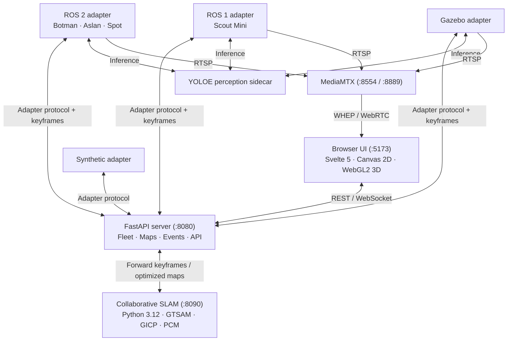

# SwarmDeck Architecture

SwarmDeck connects heterogeneous robots to a web dashboard without ROS on the
server or browser.

## 1. System Components

### A. SwarmDeck Server (`server/`)

- FastAPI, WebSockets, and NumPy; no `rclpy` or `rospy`.
- Fleet registry for identity, capabilities, telemetry, liveness, and commands.
- Map service for scan accumulation, dynamic bounds, registration, merging, and
  network-quality grids.
- Detection review, persistent settings, and timestamped event logging.
- Runs in its own virtual environment (Python 3.10+, NumPy 2.x).

### B. User Interface (`ui/`)

Svelte 5 renders the 2D occupancy map and a raw-WebGL2 point cloud. It consumes
REST/WebSocket state and WHEP/WebRTC video, with JPEG fallback and stream/link
diagnostics.

### C. Protocol Adapters (`adapters/`)

- `adapter_ros1`: ROS 1 Noetic hardware, including Scout/LVI-SAM.
- `adapter_ros2`: ROS 2 Humble/Jazzy hardware, including Bunker and Spot.
- `adapter_sim`: Gazebo fleet with planar/3D keyframe extraction.
- `adapter_mock`: synthetic fleet without ROS or a GPU.

All use the same [wire protocol](../../adapters/protocol/README.md).

### D. Collaborative SLAM Back-end (`slam/`)

- Dedicated service (`swarmdeck-slam`, port 8090) implementing trajectory-based
  collaborative SLAM.
- Ingests keyframe packets (voxel-downsampled base-frame point cloud + odometry pose).
- Generates Scan Context descriptors, retrieves candidate loop closures via KD-tree,
  and verifies them geometrically using GICP.
- Rejects false loop closures via Pairwise Consistency Maximization (PCM, minimum clique size 2)
  and Graduated Non-Convexity (GNC).
- Optimizes a joint pose graph in GTSAM and renders consistent 2D occupancy grids per
  multi-robot connected component directly from optimized trajectories.
- **Python Environment Isolation**: Strictly pinned to Python 3.12 and NumPy < 2.
  `gtsam==4.2.2` segfaults under NumPy 2.x, which is why it runs in its own isolated
  distribution (`slam/.venv`) separate from `server/.venv`.

## 2. Coordinate Frames & Transforms

SwarmDeck standardizes coordinate frames across heterogeneous robots:

| Frame | Scope | Description |
|---|---|---|
| shared/world | Fleet | Backend/UI merged frame, normally anchored to the reference robot. |
| `map` | Robot | Local SLAM frame. |
| `odom` | Robot | Continuous odometry frame. |
| `base_link` | Robot | Chassis frame. |
| sensor frames | Robot | Camera, lidar, and IMU frames. |

### Transform and tangent conventions

- **Direction**: Every transform `T_a_b` maps coordinates in frame `b` into frame `a` ($p_a = T_{a\_b} \cdot p_b$).
- **Tangent vector ordering**: GTSAM `Pose3` tangent vectors and information matrices are **rotation first** ($\omega_x, \omega_y, \omega_z, v_x, v_y, v_z$).

### 2D map merging modes

- `graph`: (default in `4robot.yaml`, `2robot.yaml`, `hardware_fleet.yaml`) Trajectory-based
  pose graph optimization in `slam/`. Occupancy grids are rendered from optimized poses,
  guaranteeing that maps cannot disagree with trajectories.
- `static`: Applies configured start transforms.
- `auto`: (legacy 2D grid stitcher) Correlates signed occupied/free grids over SE(2) with
  strict ambiguity and yaw guards. Retained as an independent diagnostic cross-check.
- `cslam`: (legacy Swarm-SLAM / RTAB-Map overlay) Consumes external collaborative graph
  summaries.

See [collaborative mapping plan](collaborative-mapping-plan.md) and [collaborative-slam.md](collaborative-slam.md) for full design details.

### Safety boundary

The `reset` capability is strictly simulation-only (`adapter_sim`, `mock_adapter`). Hardware
adapters must never advertise or implement `reset`.
