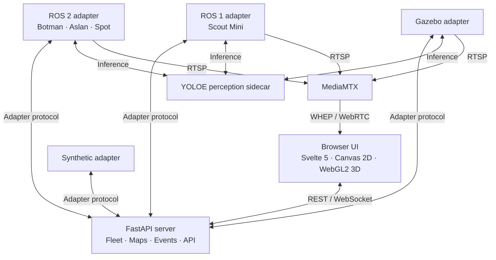

# SwarmDeck Architecture

SwarmDeck connects heterogeneous robots to a web dashboard without ROS on the
server or browser.

## 1. System Components

### A. SwarmDeck Server (`server/`)

- FastAPI, WebSockets, and NumPy; no `rclpy` or `rospy`.
- Fleet registry for identity, capabilities, telemetry, liveness, and commands.
- Map service for scan accumulation, dynamic bounds, registration, merging, and
  network-quality grids.
- Detection review, persistent settings, and timestamped event logging.

### B. User Interface (`ui/`)

Svelte 5 renders the 2D occupancy map and a raw-WebGL2 point cloud. It consumes
REST/WebSocket state and WHEP/WebRTC video, with JPEG fallback and stream/link
diagnostics.

### C. Protocol Adapters (`adapters/`)

- `adapter_ros1`: ROS 1 Noetic hardware, including Scout/LVI-SAM.
- `adapter_ros2`: ROS 2 Humble/Jazzy hardware, including Bunker and Spot.
- `adapter_sim`: Gazebo fleet.
- `adapter_mock`: synthetic fleet without ROS or a GPU.

All use the same [wire protocol](../../adapters/protocol/README.md).

## 2. Coordinate Frames & Transforms

SwarmDeck standardizes coordinate frames across heterogeneous robots:

| Frame | Scope | Description |
|---|---|---|
| shared/world | Fleet | Backend/UI merged frame, normally anchored to the reference robot. |
| `map` | Robot | Local SLAM frame. |
| `odom` | Robot | Continuous odometry frame. |
| `base_link` | Robot | Chassis frame. |
| sensor frames | Robot | Camera, lidar, and IMU frames. |

### 2D map merging

Registered scans can be raytraced into `UNKNOWN`, `FREE`, and `OCCUPIED` cells;
native occupancy grids use the same merge path. Bounds expand as robots explore.
`static` mode uses configured transforms, `auto` estimates guarded SE(2)
alignments from overlapping grids, and `cslam` consumes a collaborative graph.
See [collaborative-slam.md](collaborative-slam.md) for limits.
