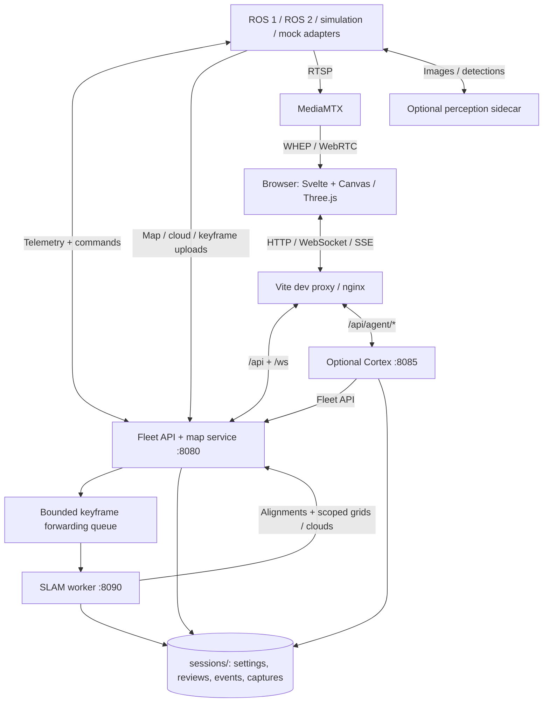

# Architecture

SwarmDeck is a service-oriented monorepo for supervising mixed robot fleets.
ROS stays at the robot/simulator boundary. The dashboard and fleet server use
HTTP and WebSockets, while collaborative SLAM has its own numerical environment.

## Components and ownership

| Component | Entry points | Responsibility |
| --- | --- | --- |
| Fleet server, port 8080 | [`api/app.py`](../../server/swarmdeck_server/api/app.py), [`mapsvc/`](../../server/swarmdeck_server/mapsvc/) | Adapter registration, capability-aware commands, telemetry, map delivery, detection review, and sessions. FastAPI; no ROS. |
| Browser, port 5173 | [`App.svelte`](../../ui/src/App.svelte), [`stores/`](../../ui/src/lib/stores/), [`Map3DScene.ts`](../../ui/src/lib/components/map3d/Map3DScene.ts) | Svelte 5/Vite, Canvas 2D and Three.js views, rendering workers, operator controls. |
| Robot adapters | [`runtime.py`](../../adapters/runtime.py), [`adapter_ros1/`](../../adapters/adapter_ros1/), [`adapter_ros2/`](../../adapters/adapter_ros2/), [`adapter_sim/`](../../adapters/adapter_sim/), [`adapter_mock/`](../../adapters/adapter_mock/) | Translate capabilities, commands, telemetry, and sensor data into the shared protocol. ROS-free helpers are shared across bridges. |
| Shared wire package | [`swarmdeck_protocol/`](../../adapters/protocol/swarmdeck_protocol/) | Keyframe and odometry codecs used by adapters, server, and SLAM; separate from the TypeScript UI types. |
| Collaborative SLAM, port 8090 | [`service.py`](../../slam/swarmdeck_slam/service.py), [`backend.py`](../../slam/swarmdeck_slam/backend.py) | Keyframe admission/capture, loop-closure verification, pose-graph optimization, and map publication. Python 3.12, NumPy < 2, GTSAM. |
| Cortex, port 8085 (optional) | [`server.py`](../../agent/agent_cortex/server.py), [`supervisor.py`](../../agent/agent_cortex/supervisor.py) | Provider-backed assistant, fleet tools, and SQLite job/event history. See [Cortex](../../agent/README.md). |
| Simulation and navigation | [`argos/`](../../argos/), [`swarmdeck_ros/src/`](../../swarmdeck_ros/src/) | ARGoS C++ plugins and ROS bridge, odometry, onboard SLAM, Nav2, and launch packages. Gazebo remains a legacy option. |
| Configuration and operations | [`configs/`](../../configs/), [`deploy/`](../../deploy/), [`scripts/`](../../scripts/) | Session YAML, Compose services, robot profiles, upstream patches, and deployment tools. |

## Runtime flow

1. An adapter registers identity and capabilities over `/adapter`, then sends
   state. The server delivers operator commands over that connection. Bulk maps,
   scans, camera fallback images, and keyframes use HTTP uploads.
2. In graph mode, [`graph_bridge.py`](../../server/swarmdeck_server/mapsvc/graph_bridge.py)
   forwards keyframes asynchronously. Both forwarding and SLAM ingestion queues
   are bounded and can drop older frames under load. A successful server upload
   does not prove durable capture or optimization.
3. SLAM retrieves Scan Context candidates, verifies geometry with GICP, rejects
   inconsistent closures, and optimizes a GTSAM graph. Its worker publishes
   alignments and map scopes back to the server. The browser consumes server
   snapshots/updates rather than calling the optimizer directly.
4. Camera streaming uses MediaMTX; JPEG fallback uses the server. Perception and
   Cortex are optional. Gaussian reconstruction is trained offline and published
   separately; it is not part of the live pose-graph loop.

The browser's `/api/agent/*` requests go to Cortex through both proxies. The
fleet server still exposes older agent routes on its own port; these are a
separate implementation, not the normal browser path.

## Frames and mapping contracts

| Frame | Meaning |
| --- | --- |
| World/shared | Fleet display and aligned map frame; the tactical 3D view uses Z-up world coordinates. |
| Robot `map` | That robot's local navigation/SLAM frame. |
| Robot `odom` | Continuous odometry frame. |
| `base_link` / sensors | Chassis and calibrated camera, LiDAR, and IMU frames. |

`T_a_b` maps points from frame b into frame a. GTSAM `Pose3` tangent vectors and
information matrices use rotation first, then translation. Keyframe clouds are
in the base frame with capture-time poses; registered map clouds and optimized
world clouds are different inputs. Respect cloud frame metadata to avoid
applying an alignment twice.

`graph` is selected by the main fleet configurations. `static` uses configured
transforms, `auto` is the legacy grid-registration path, and `cslam` consumes an
external collaborative graph. Check the selected YAML rather than assuming
all deployments share one mode. With `odometry_as_pose=true`, SLAM rendering
preserves onboard trajectories under their shared alignment; a graph update
need not repair an erroneous individual capture.

Local collision avoidance belongs to onboard sensor/costmap processing. Shared
maps can feed global planning through the map downlink. Hardware adapters never
advertise the simulation-only `reset` capability.

See [protocol details](../../adapters/protocol/README.md),
[capture timing](../operations/keyframe-yaw.md), and
[3D map behavior](../operations/tactical-3d-map.md). The
[original mapping proposal](collaborative-mapping-plan.md) explains design intent;
it is not a complete description of the current implementation.

## Architecture review and maintenance priorities

Source review, September 2026. Keep the current process boundaries: they isolate
ROS dependencies, incompatible numerical libraries, and optional services.
Prefer incremental extraction and contract tests over a framework rewrite.

| Priority | Evidence and consequence | Recommended next change |
| --- | --- | --- |
| High: single-process server state | `api/app.py` owns module-global clients, settings, reset state, and review stores; `mapsvc/service.py` owns mutable maps and locks. Multiple API workers would hold different fleet state. | Keep one server worker. Extract an explicit application-state object and lifespan-owned services with injected route dependencies before considering replication. |
| High: duplicate assistant implementation | `server/swarmdeck_server/api/agent_routes.py` launches AGY directly, while browser proxies use the provider/supervisor implementation in `agent/`. Fixes to one path need not affect the other. | Audit direct-port consumers, then retire or forward legacy chat routes with compatibility tests; retain server-owned robot control endpoints. |
| High: privileged optional service | Cortex Compose mounts the source workspace and can receive provider/SSH credentials. The normal provider path is not isolated by the typed shadow-planner boundary; the API lacks authentication. | Keep Cortex opt-in. Separate coding-worker privileges from fleet execution and add enforced identity/authorization before broader deployment. |
| Medium: large orchestration modules | Adapter entry points, `api/app.py`, and `slam/backend.py` each mix substantial lifecycle and domain logic. Shared `adapters/runtime.py` and extracted map/route modules already provide useful seams. | Extract one responsibility at a time when changing it; verify reconnection, resets, command cancellation, and frame contracts at the boundary. |
| Medium: reproducibility and verification | Python manifests mostly use lower bounds; ROS/native checks need images or hardware. A unit suite cannot establish live sensor or navigation behavior. | Add per-environment Python constraints/locks after validating supported robot runtimes, and maintain simulation/hardware acceptance checks separately from ROS-free CI. |

Repository maintenance now includes separate server, Cortex, SLAM, and UI test
commands and CI jobs, a short root `AGENTS.md`, and one current architecture
reference. Keep task history in Git/PRs and remaining product work in the
[roadmap](roadmap.md), rather than duplicating status in progress documents.
