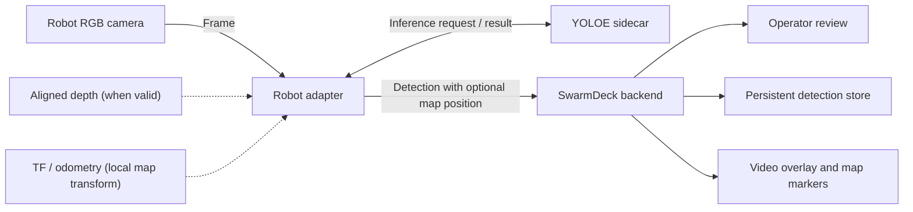

# Perception & Object Detection

SwarmDeck detects configured object classes, optionally projects them through
depth into the map, and asks the operator to review located observations.

## 1. Detection Architecture

1. `adapters/perception/yoloe_server.py` runs YOLOE-26n segmentation and
   returns class, confidence, normalized box, and optional polygon.
2. `adapters/perception/catalog.py` defines the supported classes, prompts, and
   capture floors; reference images live in `tests/perception/fixtures/`.
3. `adapters/perception/depth_projection.py` samples aligned depth inside the
   detection mask, rejects invalid/floor/background values, and transforms the
   result into the robot's local map frame.

Missing or stale depth/TF removes only `map_position`; video boxes still work.
The backend converts valid local positions into the shared map frame.

---

## 2. Operator Review & Persistence

Located observations enter a review queue. The operator may accept, ignore, or
merge a proposal into an existing same-class object. Nearby repeated sightings
are folded into the entity only after enough viewpoint movement, preventing a
parked robot's depth bias from dominating the average position.

Class and per-robot confidence floors are applied by the backend and can be
changed without discarding lower-confidence evidence already captured. Reviewed
entities and decisions persist in `sessions/detections.json`.
