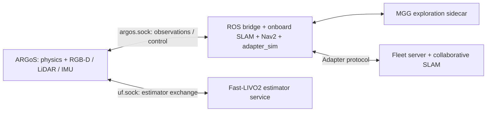

# Simulation

**ARGoS is the default simulator**, selected by `scripts/sim-up`, the simulation
Compose service, and the ROS session launch file. It uses the pinned ARGoS fork
with Jolt physics and Filament rendering. Gazebo remains an explicit legacy
comparison path.

## Start, build, and stop

Run from the repository root with Docker, Compose v2, and `make` installed:

```bash
make up-sim                            # indoor, software rendering, Fast-LIVO2
make up-sim RENDER=gpu                 # NVIDIA Container Toolkit required
make up-sim RENDER=dri                 # Intel/AMD; /dev/dri required
make up-sim SCENARIO=bistro RENDER=gpu  # external Bistro assets required
make up-sim SCENARIO=3robot ODOMETRY=drift  # lighter mixed-fleet development
make build-sim RENDER=gpu              # build the same selected stack only
make up-sim SIM_ARGS=--dry-run          # inspect configuration without starting
make down-sim                         # stop simulator, bridge, estimator, MGG
make docker-down                      # stop the whole project, including UI
```

Options: `SCENARIO=default|bistro|3robot|path.yaml`,
`RENDER=software|gpu|dri`, `ODOMETRY=fast_livo2|drift`, `TARGETS=10`, and
`EXPLORE=0`. `SIM_ARGS=--no-build` reuses images. Use the same
`COMPOSE_PROJECT` override when building, starting, and stopping an isolated stack.

The first build compiles large ROS and native dependencies. Open
<http://localhost:5173> and allow time for staggered robot registration.
`down-sim` preserves core dashboard services and recorded sessions but removes
the generated simulation runtime volume. `docker-down` keeps Docker volumes;
`docker-purge` explicitly deletes them and locally built images.

## Runtime and ownership



The shared runtime directory is `/run/swarmdeck`. The bridge and estimator bind
sockets; ARGoS connects to them. The `uf` socket/medium name is retained for
protocol compatibility and does not mean Ultra-Fusion is the default estimator.
The estimator runs in its own ROS environment; its pose returns through ARGoS.
With `ODOMETRY=drift`, the external estimator service is omitted.

[`spawn_fleet.py`](../../swarmdeck_ros/src/swarmdeck_sim/scenario/spawn_fleet.py)
owns robot/sensor specifications shared by the world generator, bridge, and
navigation configuration. `make_argos_world.py` creates procedural geometry;
`make_argos_session.py` writes the ARGoS experiment. Runtime files are generated
into the shared volume. ARGoS waits for a fresh experiment; a standalone ARGoS
restart against an existing bridge may need `ARGOS_ACCEPT_STALE=true`.

Keep runtime paths short: Unix socket paths have a platform length limit.

## Scenes and robots

- **Indoor (default):** seeded rooms, furniture, and detection targets.
  `configs/4robot.yaml` currently uses four Bunkers; `configs/3robot.yaml` uses
  a mixed fleet. Procedural visual and collision meshes are separate: the
  collision copy omits the floor slab because Jolt already supplies a ground plane.
- **Bistro:** an external street-scene mesh used for both collision and rendering,
  with matched transforms and mesh-derived prop heights. Current Bistro fleet
  configurations start robots together with clearance, not around the entire road.
  Do not apply the procedural floor-slab convention to the Bistro mesh.

Bistro requires `bistro_exterior.glb`, its lighting include, and environment
assets from the ARGoS examples. Set `SWARMDECK_BISTRO_DIR` to the asset directory;
the default Compose mount points to the sibling
`../argos3-examples/experiments/bistro_exploration/assets`. See the Compose file
for the mounted container path. The assets are not bundled in this repository.

Robot visuals must have matching `<type>.visual.xml` descriptors; otherwise a
robot can be absent from rendered RGB, depth, and LiDAR. Spot's simulation uses
a standing rigid-body envelope with differential steering, not a simulated gait.
See [robot visuals](../../argos/assets/robots/README.md).

## Sensors and odometry

The generator currently uses 100 physics ticks/s, 10 Hz LiDAR, 5 Hz cameras,
and 10 Hz bridge exchange. Camera resolution defaults to 320×240 and is
configurable. Robot YAML selects the LiDAR profile; the standard 17-ring profile
includes a horizontal ring for the planar mapping scan. Check generated settings
when changing a profile rather than inferring sensor rates from UI video settings.

`fast_livo2` selects the source-built Fast-LIVO2 frontend. The normal odometry
path does not add the legacy wheel/IMU EKF. Camera/LiDAR/IMU input settings and
calibration must agree with the estimator configuration; selecting an estimator
alone does not prove that every modality is active or correctly synchronized.
`drift` perturbs simulated motion and is useful for interface/debugging work;
it cannot establish sensor-driven estimator accuracy.

The observation bridge and the external-estimator exchange have different
capture-time contracts. See [simulation performance](../operations/simulation-performance.md)
for the current limitation, timing checks, reset behavior, and measured costs.
Historical Ultra-Fusion measurements do not describe current Fast-LIVO2 performance.
Keep DDS receive buffers sufficient for large clouds; inspect the pinned
estimator startup scripts and receive counters before tuning its algorithm.

The planar navigation scan and range-limited proximity scan come from the same
3D cloud. Collision handling stays with onboard sensor/costmap processing.
A map view that looks plausible is not evidence that obstacle sensing is correct.

## Exploration

`make up-sim` includes MGG and starts with `EXPLORE=0`: robots remain stationary
until an operator sends a goal or presses **Explore**. `EXPLORE=120` requests a
bounded startup exploration. See [MGG exploration](../operations/mgg-exploration.md)
for start/stop gates, lifecycle reporting, and hardware differences.
The [coordinated frontier planner](coordinated-exploration.md) documents a legacy
Gazebo comparison; it is not the default ARGoS control path.

## Verification and host development

```bash
make test-server                      # ROS-free contracts and scenario checks
make docker-test-launch               # actual ROS launch descriptions in image
make visual-test                      # host ARGoS sensor capture/contact sheet
make visual-test VISUAL_CONFIG=configs/4robot_bistro.yaml
bash tests/integration/test_argos_headless.sh
```

Visual/headless checks require the ARGoS fork and SwarmDeck plugins installed
on the host, plus NumPy/Pillow and their script-specific prerequisites. They
exercise real rendering; unit tests do not. Bistro-dependent unit checks skip
when the external assets are unavailable, and ROS checks skip outside ROS.

[`Dockerfile.argos`](../../deploy/docker/Dockerfile.argos) is the source of truth
for the fork revision, Filament SDK, compiler, build flags, and upstream patches.
Use those same versions for a host build; do not build a floating fork revision
and assume it matches Compose. Build this repository's plugins with:

```bash
cmake -S argos -B argos/build -DCMAKE_BUILD_TYPE=Release
cmake --build argos/build -j
```

For advanced host ROS development, after building and sourcing the workspace:

```bash
mkdir -p /tmp/swarmdeck
ros2 launch swarmdeck_bringup session.launch.py \
  sim_backend:=argos launch_argos:=true odometry:=drift runtime_dir:=/tmp/swarmdeck
```

External-estimator host development additionally needs its socket service.
Use [simulation benchmarks](../operations/simulation-performance.md) for performance
claims; record the machine, configuration, revisions, and real-time factor.

## Legacy Gazebo backend

Gazebo and Swarm-SLAM are retained for comparisons, with explicit Compose commands
instead of default Make targets. These paths are not validated by ARGoS checks.

```bash
# Legacy Gazebo with a cheap planar sensor profile
SWARMDECK_CONFIG=/app/configs/baseline_legacy.yaml \
docker compose -f deploy/compose/docker-compose.yml --profile gazebo \
  up --build -d server ui slam mediamtx duck_detector gazebo

# Legacy RTAB-Map + Swarm-SLAM comparison (NVIDIA)
SWARMDECK_CONFIG=/app/configs/4robot_cslam.yaml SLAM_BACKEND=rtabmap \
docker compose -f deploy/compose/docker-compose.yml \
  -f deploy/compose/docker-compose.gpu.yml \
  -f deploy/compose/docker-compose.cslam.yml --profile gazebo up --build -d

# Stop either comparison, keeping volumes
make docker-down
```

The old `tests/integration/run_stack.sh` / `stop_stack.sh` helpers operate a host
Gazebo stack. Read their prerequisites and shutdown scope before using them.
