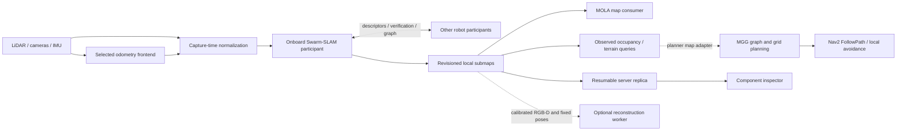

# Decentralized autonomy integration

The `planning-refactor` branch introduces an opt-in onboard mapping path and
full-path MGG execution. Existing deployments keep their current map and motion
configuration until their platform validation is complete. The detailed design
and acceptance gates are in the [integration plan](../architecture/decentralized-autonomy-plan.md).

## Components and ownership



The Python `autonomy` package has no ROS or MOLA imports in its contracts and
replication code. The geometry mapper uses NumPy; native MOLA integration lives
in `swarmdeck_ros/src/swarmdeck_mapping`. Swarm-SLAM supplies corrected poses.
The MOLA consumer does not optimize them or publish competing TF edges.

The default MGG deployment retains its OctoMap for high-rate grid expansion and
gain calculations. Its final corridor check can use one bounded indexed-map
request before returning Explore, Navigate, or ReturnHome. Both that index and
MOLA consume the same corrected snapshot and immutable chunks; the query does
not deserialize the `.metricmap` artifact or make RPC calls per planner voxel.

## Build and test

Run from the repository root:

```bash
docker build -f deploy/docker/Dockerfile.cslam -t swarmdeck-cslam:planning .
docker build -f deploy/docker/Dockerfile.mapping -t swarmdeck-mapping:phase0 .
docker build -f deploy/docker/Dockerfile.mgg -t swarmdeck-mgg:planning .
docker build -f deploy/docker/Dockerfile.sim -t swarmdeck-sim:planning .
docker build -f deploy/docker/Dockerfile.argos -t swarmdeck-argos:planning .

PYTHONPATH=.:server server/.venv/bin/python -m pytest autonomy/tests \
  adapters/test/test_exploration.py adapters/test/test_peer_coordination.py \
  server/tests/test_replica_views.py -q
```

The recorded local MGG validation used the same recipe under the
`swarmdeck-mgg:indexed` tag. This first command enables `mgg_ros` tests and runs the
typed objective/indexed-query tests with at most two compiler jobs:

```bash
docker run --name swarmdeck-mgg-indexed-native --rm \
  swarmdeck-mgg:planning bash -lc '
    set -e
    source /opt/ros/jazzy/setup.bash
    cd /opt/mgg/ros2
    CMAKE_BUILD_PARALLEL_LEVEL=2 colcon build --packages-select mgg_ros \
      --executor sequential --cmake-args -DCMAKE_BUILD_TYPE=Release \
      -DBUILD_TESTING=ON
    source install/setup.bash
    colcon test --packages-select mgg_ros --executor sequential \
      --event-handlers console_direct+ --return-code-on-test-failure
    colcon test-result --verbose'
```

The inert DDS contract smoke uses an isolated ROS domain and an action server
that records and cancels paths without publishing velocity commands:

```bash
docker run --rm \
  -e ROS_DOMAIN_ID=219 -e FASTDDS_BUILTIN_TRANSPORTS=UDPv4 \
  -v "$PWD:/app/swarmdeck:ro" swarmdeck-mgg:planning bash -lc '
    set -e
    source /opt/ros/jazzy/setup.bash
    source /opt/mgg/ros2/install/setup.bash
    cd /app/swarmdeck
    PYTHONPATH=/app/swarmdeck:$PYTHONPATH timeout 120 /usr/bin/python3 \
      adapters/test/ros/mgg_contract_smoke.py'
```

The MOLA image runs native insertion, correction, snapshot immutability, and
replacement tests during its build. It also imports the actual Python snapshot
and chunk format and serializes a MOLA metric map. MOLA 2.9.0 is pinned because
that is the version available in the tested ROS Jazzy repository; the compiler
checks for the required keyframe pose-update API.

Add `deploy/compose/docker-compose.mapping.yml` to a peer compose invocation to
run the server-independent MOLA consumer. It watches the shared `peer_maps`
volume and publishes a checked per-component artifact index under each peer's
`mola/` directory. The worker does not join the ROS graph and owns no TF edges.
For the ARGoS stack, start both mapping consumers with:

```bash
docker compose -f deploy/compose/docker-compose.yml \
  -f deploy/compose/docker-compose.peers.yml \
  -f deploy/compose/docker-compose.mapping.yml \
  --profile argos up -d mapping mapping-query
```

`autonomy.indexed_mapping.IndexedMapView` separately builds an immutable sparse
voxel view for MGG. It caches decoded chunks by SHA-256, so a pose-only graph
revision rebuilds transformed indexes without rereading geometry. Replacement
and retraction publish a new index and cannot leave an old occupied voxel active.
The defaults bound input to 1,000,000 points, 2,000,000 total voxels, 4,000,000
ray steps, eight seconds of background build time, 4,096 samples, 1,000,000
queried body voxels, and 250 ms per service query. Exceeding any bound produces
`UNAVAILABLE`; a revision mismatch produces `STALE`. Unknown space remains
unknown. Five-degree angular ray selection retains only actual measured rays to
keep dense spinning-lidar free-space indexing bounded.

The ROS adapter is `deploy/autonomy/indexed_map_server.py` and serves
`/<robot>/mapping/query_batch`. Requests contain component-frame samples and an
exact `(component_id, epoch, graph_revision, geometry_revision, source_stamp)`
key. `source_stamp` is the newest active submap's original ROS capture time. A
canonical `SWARMDECK_MISSION_ID` is required, and discovery is restricted to
`/maps/<mission>/`; historical missions on a persistent volume are never
selected implicitly. The service separately tracks successful coherent reads
with a local monotonic clock. Re-reading an unchanged snapshot refreshes that
deadline without rebuilding the index or rereading chunks, so a stationary map
does not expire while its producer and filesystem remain healthy. MGG
transforms route samples with the authoritative `T_component_navigation`, calls
once for a densified corridor, and rejects stale, unavailable, occupied,
unknown, excessive step/drop, roughness, or insufficient measured-clearance
results. Clearance is finite only when an overhead return bounds it or measured
rays cover the complete requested body volume; occupied terrain points alone do
not certify it. A `NaN` clearance remains unknown. The deterministic VLP-16
test uses nine captures over four travelled metres: accumulated ground rays
certify a Bunker-sized 1.6 m forward corridor, an unseen interval stays
`UNKNOWN`, and a wall is `OCCUPIED`. A lone sparse scan generally cannot cover
every body voxel, so enabling the indexed gate from a cold start can block
exploration until another trusted controller has accumulated enough ray
coverage. The gate remains opt-in for that reason.

Terrain queries select the observed surface beneath the queried robot body,
rather than the lowest return in the whole column. Local regression fixtures
cover stacked floors, downward steps, missing ground, walls, and gentle ramps.
Both body cells and terrain-column probes count toward the query work budget;
oversized bodies and unrepresentable coordinates are rejected before allocation.
In a local 15-sample flat-surface microbenchmark, 280 measured queries after
20 warmups had median/p95 times of 0.481/0.512 ms versus 0.497/0.531 ms before
the change. This small CPU fixture is not a Jetson latency or terrain-accuracy
qualification.

Swarm-SLAM repository commits are pinned in `deploy/cslam/upstream.repos`.
The local patch adds mission and causal solution identities, checks successful
results, rejects older results, and carries the actual component anchor pose.
All participating peers must use the same patched message definitions.

## Isolated ARGoS workstation run

The test overlay uses UI port **15173**, API **18080**, SLAM diagnostics **18090**,
and a separate Compose project. Use a separate checkout and its `sessions/`
directory so another deployment's state is not reused. Bistro's runtime assets
are `bistro_exterior.glb`, `bistro_lamps.inc`, and the precomputed lighting KTX
files under the sibling `argos3-examples` checkout; the source FBX/texture archive
is unnecessary at runtime.

```bash
export SWARMDECK_MISSION_ID="$(python3 -c 'import uuid; print(uuid.uuid4())')"
export SWARMDECK_TEST_DOMAIN=173  # choose an unused domain for this mission
export SWARMDECK_CONFIG=/app/configs/4robot_bistro.yaml

docker compose -p planning \
  -f deploy/compose/docker-compose.yml \
  -f deploy/compose/docker-compose.gpu.yml \
  -f deploy/compose/docker-compose.mgg.yml \
  -f deploy/compose/docker-compose.planning-test.yml \
  -f deploy/compose/docker-compose.peers.yml \
  --profile argos up -d --no-build \
  server slam mediamtx duck_detector sim argos mgg ui peer0 peer1 peer2 peer3
```

The peers initially run **shadow mapping** alongside the existing navigation
map. They exchange SLAM information directly through ROS middleware and upload
immutable map chunks to the server independently. Stopping the test server must
not stop map capture or optimization; motion still follows the existing
stop-on-operator-loss policy. Do not interpret that stop as a mapping dependency.

The test overlay explicitly uses UDP for containers sharing a network namespace
but separate IPC namespaces. This is a test transport choice, not a requirement
to disable shared memory between colocated production ROS processes.

To enable leased target arbitration after peer frame validation, set
`SWARMDECK_PEER_COORDINATION=1` in the simulation adapter environment. It requires
fresh `/robot_N/map_authority` messages. Without them, exploration waits instead
of assuming an identity transform between robots. Reservations share
`/swarmdeck/intentions`; costs and deterministic robot-ID tie breaking resolve
conflicting targets within one established component. A partition can cause
redundant coverage after leases expire. Component-local exhaustion alone does
not establish fleet completion.

To switch the isolated simulation from shadow mapping to onboard navigation,
append `docker-compose.mapping.yml` and `docker-compose.onboard-planning.yml`
to that invocation, and also start `mapping` and `mapping-query`. This sets
`SWARMDECK_MAPPING_AUTHORITY=onboard`, `SWARMDECK_PLANNING_BACKEND=mgg`, and
`SWARMDECK_PEER_COORDINATION=1` on the adapter. The adapter stops uploading
keyframes to the central optimizer and stops downloading its navigation grid.
ROS callbacks forward each robot's own SLAM grid to Nav2 independently of the
operator connection. A grid must already have the exact configured navigation
frame; the adapter never relabels an incompatible frame. Local maps and scan
telemetry can still be uploaded for the dashboard.

The indexed final corridor gate remains separately opt-in with
`SWARMDECK_INDEXED_MAP_QUERY=1`: sparse cold-start LiDAR coverage can leave the
body volume unknown and prevent any exploratory movement. Until sensor coverage
is validated, MGG uses its existing OctoMap and Nav2 local avoidance. This is
an explicit deployment choice, not a fallback after an indexed query fails.

Adapters with MGG configured advertise `plan_objective`. The GUI then sends
Navigate and Return Home objectives directly to that robot, without requiring
a central A* route. Return Home resolves the initial keyframe through the fresh
onboard correction; the server does not substitute its cached home coordinates.
Nav2 FollowPath receives the complete MGG path. Removing the onboard overlay
and restarting the adapter restores the legacy central map path.

Every fleet Explore command carries a shared run UUID and participant list.
Robots exchange progress over `/swarmdeck/exploration_reports`. Completion means
all participants freshly report exhaustion of reachable frontiers, with no
assignments, in one verified component. Missing reports, disconnected components,
and map corrections prevent a fleet-complete report. Stop exploration and Stop
All invalidate exhausted status. This criterion does not certify coverage of
unobservable or unreachable physical space.

## Map persistence and replication

Each peer writes its own map under `/maps/<mission UUID>/<robot>/`:

- `geometry/`: SQLite metadata, calibrated captures, immutable XYZ-F32 chunks.
- `snapshot.json`: atomically replaced coherent map manifest.
- `status.json`: capture, optimization, and replica acknowledgement counters.
- `frontend-lifetime`: guard against reusing upstream keyframe IDs after restart.

The mapper keeps geometry in submap coordinates. Pose corrections update
transforms; geometry replacements and retractions remove the old active
contribution. Free-space queries require measured rays with known origins.
Absence of a point is never sufficient to declare traversability or clearance.

Optimizer diagnostics distinguish received results, accepted results, unchanged
accepted results, and applied corrections. `last_solution_order` records the
latest accepted causal identity. The legacy `solutions` counter counts only
pose-changing corrections; zero does not mean the optimizer is inactive.

The server exposes `/api/autonomy/replicas` and content-addressed
`/api/autonomy/chunks/<sha256>`. A manifest becomes visible only after every
referenced chunk exists. Reconnects negotiate missing hashes in one manifest request and transfer only
missing geometry. Pose-only updates reuse those hashes. The **Onboard map replicas**
control opens an inspector with explicit robot, session, and component selection.
It does not overlay disconnected components or issue navigation commands.

The server replica defaults to a 1 GiB geometry budget
(`SWARMDECK_REPLICA_MAX_BYTES`). When an upload reaches that limit, it first
reclaims up to 256 unreferenced chunks whose grace interval has elapsed. The
interval defaults to one hour (`SWARMDECK_REPLICA_RETENTION_S`) and starts again
when geometry loses a manifest reference or is uploaded again. Every published
robot/session manifest protects its referenced chunks, including shared geometry
and historical missions. A robot uploading over a very slow connection may need
to renegotiate missing hashes after the grace interval. Pose-only corrections
reuse geometry and do not make its chunks eligible for collection.

Inspect a bounded collection batch without deleting geometry:

```bash
python3 -m autonomy.replica_maintenance /data/replicas
# Add --collect to reclaim that eligible batch; no manifests are retired.
```

Publication, storage accounting, and collection use SQLite writer transactions
across server workers. Startup recovers interrupted file/metadata operations.
Collection never makes room by dropping a published map; storage exhaustion
remains explicit if protected geometry fills the budget. The onboard store
defaults to 512 MiB. Onboard archival and explicit retirement of old server
missions remain deployment policies to implement before long missions.

## ROS 2 hardware seam

`deploy/autonomy/peer.launch.py` runs one participant on one robot. Set
`SWARMDECK_PEER_NAMES` to the same ordered JSON robot list on every peer and
`SWARMDECK_PEER_INDEX` to that robot's index. Configure `SWARMDECK_CLOUD_TOPIC`,
`SWARMDECK_BASE_FRAME`, `SWARMDECK_ODOM_FRAME`,
`SWARMDECK_NAVIGATION_FRAME`, and `SWARMDECK_SENSOR_NAMESPACE` for its calibrated
ROS graph. Hardware with global TF topics should set `SWARMDECK_TF_TOPIC=/tf`
and `SWARMDECK_TF_STATIC_TOPIC=/tf_static`. Keep each robot's existing
`ROS_DOMAIN_ID` as its local sensor, adapter, MGG, and indexed-query domain. Set
one common, unused ROS domain across the participating robots as
`SWARMDECK_PEER_DOMAIN_ID`; if it is omitted, the bridge retains the existing
single-domain behavior. The dual-domain bridge consumes raw cloud and TF only
from the local domain, sends normalized cloud/odometry to Swarm-SLAM on the
peer domain, and returns map authority and keyframe metadata locally. It relays
only bounded `/swarmdeck/intentions` and `/swarmdeck/exploration_reports` JSON
between the domains. Robot-ID direction filters prevent relay loops, and the
JSON bytes are preserved exactly.
`deploy/compose/docker-compose.robot-peer.yml` profile packages this participant
with host networking and a persistent onboard map volume; the server URL is
optional. It does not change existing robot deployment defaults. Sensor normalization requires capture-time TF; it never substitutes
the latest pose for an older scan. The current TF input has no estimator
covariance or scan deskew interval, so these remain explicitly unknown at that
boundary. Selecting a full calibrated odometry/capture provider is required for
platform qualification.

The same `peer_mapping` profile provides optional `peer_mola_mapping` and
`peer_mapping_query` services on `onboard_peer_maps`. Start the three explicitly
after building the current mapping image:

```bash
docker compose -f deploy/compose/docker-compose.robot-peer.yml \
  --profile peer_mapping up -d \
  peer_mapping peer_mola_mapping peer_mapping_query
```

Hardware adapters read autonomy selection from their YAML. Qualifying a robot
for MGG planning and peer coordination therefore requires these explicit
additions alongside its existing `exploration.planner` calibration:

```yaml
actions:
  follow_path: /robot_namespace/follow_path  # real Nav2 FollowPath server
planning:
  backend: mgg
exploration:
  enabled: true
  peer_coordination: true
```

Set `SWARMDECK_MAPPING_AUTHORITY=onboard` in that adapter's environment. The
configured `follow_path` action must execute the complete MGG path; a robot with
only waypoint, trajectory, or direct velocity control needs a qualified path
adapter before enabling this configuration.

The query service uses host networking, host IPC, the local ROS domain,
and the exact mission UUID. The MOLA worker remains ROS-independent. Starting
these services does not enable MGG's client; set `SWARMDECK_INDEXED_MAP_QUERY=1`
only in a separately qualified MGG deployment after sufficient measured
free-space coverage exists.

`SWARMDECK_SERVER_URL` is optional. Peer discovery and graph exchange must remain
reachable without the dashboard or a server-hosted router. Test the actual
Humble/Jazzy and physical network combination before rollout. This branch does
not enable new motion defaults on hardware.

**Restart limitation:** upstream Swarm-SLAM uses robot-local integer keyframe IDs
without persisted estimator epochs. The launch exits if an authority process
dies, and a lifetime marker prevents a silent restart. Start a fresh fleet mission
and ROS domain after a frontend restart. Transparent single-peer restart and
restoration of its graph remain an upstream persistence task; the marker is a
fail-closed boundary, not a recovery implementation.

## Gaussian reconstruction

The [reconstruction jobs guide](reconstruction-jobs.md) describes optional fixed-
pose UMAMI batch jobs, immutable input manifests, cancellation, budgets, and stale
result rejection. The interface and fake-trainer tests run without private
sources or CUDA. Native UMAMI training, corrected Gaussian submap instancing,
and an onboard incremental trainer require their own validation. Gaussian
opacity is not occupancy and is not supplied to collision planning.

## Validation record

Local validation on 2026-09-09 includes the native MGG image, 18 ROS planner
tests, and a DDS fixture exercising full-path Explore, Navigate, cancellation,
and late-response fencing. The indexed fixture checks the exact component
transform and a 50 ms deadline against a delayed service response. The Python
autonomy, adapter, replication, reconstruction, command-routing, and backend
batch passed 332 tests from a clean export of the staged refactor, excluding
unrelated workspace edits.
Svelte type checks and the production build pass.
The browser rendered a local 7,800-point replica fixture. Replica preview code
loads on demand, limits rendering to 50,000 points and downloads to 64 MiB, and
preserves the camera and cached geometry during pose-only updates.

The local two-peer Swarm-SLAM fixture verifies a known 0.4 m translation and
6-degree yaw without a server. It requires both recipient estimates from the
same `(solution_clock, optimizer_robot_id, origin_robot_id)` and checks their
reported anchor. This exposed an upstream LiDAR transform-direction error:
TEASER/ICP estimates source points into destination coordinates, while GTSAM's
BetweenFactor requires the destination pose in source coordinates. The adapter
now inverts that relation before publishing either kind of LiDAR closure.
The corrected image passed the joint-solution fixture in about 25 seconds.
Bounded correspondence selection also prevents the prior multi-minute exact
clique search; the inlier acceptance threshold remains unchanged.

The native indexed-map ROS smoke checks actual generated request/response
serialization, FREE/OCCUPIED/UNKNOWN arrays, and stale key/timestamp rejection.
It caught and fixed a collision with rclpy's internal `_services` member that
unit tests of the index alone could not detect. The local MOLA native build
passed both C++ tests and serialized the Python fixture to a metric map.
The native dual-domain bridge smoke publishes conflicting `odom -> base_link`
transforms on the local sensor and shared peer domains. Normalized odometry uses
the local transform, raw TF/cloud never appears on the peer domain, normalized
capture reaches the peer domain, and authority/keyframe metadata returns only
to the local domain. Exact intention and exploration-report JSON crosses in
each permitted direction once; oversized payloads are rejected.

On the authorized amd64 workstation, ROS Jazzy Swarm-SLAM compiled with the
versioned message patch and its native Open3D/TEASER/message imports passed.
MOLA 2.9.0 compiled and passed native correction/replacement tests and the
Python-to-MOLA serialization smoke. Python tests cover stale solutions,
component changes, atomic replication, reconstruction cancellation, lease
expiry/reordering, and full-path execution arbitration.

The isolated four-robot Bistro ARGoS run produced keyframes and durable replicas
from all four robots (11, 14, 10, and 44 keyframes in the first bounded exploration
run). With only the test server stopped for 20 seconds, scan normalization
continued on every robot and robot 0 advanced its optimized map from revision 81
to 83 while its acknowledged revision stayed at 81. After restart, replication
advanced to revision 84 and the error cleared. This establishes server-independent
capture and solution processing; it does not establish inter-robot closure accuracy
or continued motion during an operator-link outage. Arm64 builds, physical robot trials,
transparent peer restart, and comparative four-robot coverage are separate
acceptance gates and must not be inferred from these unit/build results.

After reconnecting the workstation, a fresh mission
`88492d31-5c28-4de9-bbbd-8bfb1a74014d` ran Bistro with onboard authority, MGG
objectives, and peer coordination enabled. All four robots executed paths during
a 90-second Explore trial. Independently recorded ground-truth displacements
were approximately 12.7, 3.8, 15.1, and 25.2 m; the peers captured 26, 16, 32,
and 54 keyframes with no dropped keyframe pairs. Robot 1 encountered repeated
controller progress failures. All four reported stopped, inactive navigation,
and empty paths after Stop All; a subsequent short run also verified the
observer's command-write and shutdown handling. These measurements establish
execution, not exploration coverage or successful fleet coordination: the maps
remained in four disconnected components, and no inter-robot alignment was
validated. Singleton optimizer results were accepted without pose corrections.

A subsequent Return Home trial exposed an integration error: with the optional
indexed query disabled, MGG compared the request's onboard component ID with
its static local frame and rejected the request before path search. Authority
validation is now independent of that query option. An authority-bound request
must match the fresh component, graph, geometry, and source timestamp; the static
frame fallback applies only when no authority or snapshot metadata exists.
The original failed trial produced no route and no arrival: independent ground
truth stayed approximately 26.3 m from home. Stop All cleared navigation.
Five native objective-service tests cover this fix. A fresh mission
`b7f9edbb-4e97-4dcb-93bd-841baf074dd0` then executed a 25-second Explore trial
with all four robots and passed authority validation on Return Home. It exposed
a separate persistent-graph problem: Spot's first global vertex was inserted
after it had moved about 1.4 m, leaving home outside the graph; subsequent
parent connections also failed. Return Home produced no route, and independent
ground truth remained 6.32 m from home. This trial does not establish successful
return navigation.

The follow-up patch captures the initial home anchor from the first finite
odometry before motion. It keeps that landmark disconnected until mapped
support and free body clearance admit a terrain-following edge. Graph lookup
bounds both the current-pose and goal connections. Planner paths retain their
internal driving-height convention and are converted to robot base poses only
at response/publication boundaries. Explore retains the local graph's existing
startup policy for a root whose ground has not yet been observed; explicit
destinations still require mapped support. The updated patch has not yet been
retested in Bistro because the remote workstation became unreachable. Native
tests passed 23 cases covering graph lookup/update, authority validation,
supported Home corridors, base-height conversion, and the Explore refinement
boundary with unobserved ground beneath the root. Those fixtures do not establish
end-to-end cold-start exploration or return execution.

The operator reports that Bistro needs `max_mean_error` near 0.6 in the existing
registration pipeline. That parameter belongs to `swarmdeck_slam.verify`; native
Swarm-SLAM uses different admission controls. Investigating the relationship
and validating closure accuracy is deferred; this refactor does not relax either
pipeline's acceptance thresholds.

The trial also exposed repeated rebuilding of an unchanged map that exceeded
the indexed-map time budget. Failed sources now retry with exponential delays
from one to 60 seconds, retaining decoded chunks and returning unavailable.
A changed snapshot bypasses the delay, and healthy peers continue refreshing.
With the fleet stopped, a subsequent worker sample used about 1.5% of one CPU
instead of the earlier sustained full core. This is an idle observation, not a
worst-case build benchmark; budget-limited maps still return unavailable.

To repeat the bounded observation against the isolated API, use
`adapters/test/ros/onboard_exploration_observer.py --mission-id <UUID>` on the
workstation. It samples fleet and replica state and issues Stop All on exit.
Run `adapters/test/ros/simulation_evidence_recorder.py` in the simulation's ROS
domain before starting peers to retain first-keyframe timestamps and independent
ground truth. Its trajectory-cell overlap is a diagnostic heuristic, not a
sensor-coverage measurement.

For a bounded Return Home check, use
`python3 -m adapters.test.ros.onboard_return_home_observer` with an explicit
`--robot-id`, `--mission-id`, and `--authority-file`. Capture the authority as
plain JSON with `ros2 topic echo --once --field data --full-length`, removing
the trailing `---` separator. The fixture must be less than 30 seconds old.
Run the observer with the simulation image's Python and `websockets` dependency,
host networking, and a writable evidence directory; overriding the image's
entrypoint prevents it from starting another simulator. Reports are checkpointed
atomically and Stop All runs on exit. The observer checks full-path execution
against the corrected home projected into the server's display frame. Its
success evidence still requires review against independent ground truth and
stable map-authority transforms.

## Remaining acceptance work

The integration boundaries are implemented; the full rollout plan remains in
progress. In particular:

- Measure duplicate coverage and inter-robot alignment in the four-robot Bistro
  scenario after the deferred admission investigation. The onboard run above
  establishes four-robot execution but does not pass these accuracy gates.
- Exercise peers on separate hosts through partitions, rejoin, and optimizer
  loss. A frontend restart currently requires a fresh fleet mission and domain;
  transparent restart with preserved native graph state is not implemented.
- Validate each physical robot's calibrated capture, ARM image, and local
  controller. Moving-obstacle and blind-corner behavior needs controlled trials.
- Establish a sensor coverage/bootstrap policy before enabling the strict indexed
  terrain gate. MGG still uses its local OctoMap for frontier construction and
  information gain; Inspect and Rendezvous remain unsupported objectives.
- Run the native CUDA reconstruction and measure alignment, memory, training
  time, and rendering cost. Online incremental training remains a later step.
