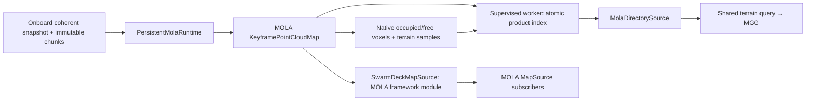

# Native MOLA runtime

The `planning-refactor` pipeline gives MOLA persistent ownership of corrected
point geometry. Swarm-SLAM remains the pose-graph authority. MOLA neither runs a
second optimizer for these maps nor publishes another `map → odom` transform.

The framework and planner paths share the same C++ geometry runtime:



The native planner product adds occupied/free voxels and terrain samples to the
point-geometry layer. Both the MOLA provider and the existing indexed provider
use the same terrain-query implementation. In the simulation MOLA path, MGG
reads this immutable native grid directly for graph/grid work, without an
OctoMap conversion. Occupied-only collision checks retain measured surface
heights; strict queries and missing height evidence retain full voxel bounds.
Unknown cells remain unknown. The independent raw-cloud/depth mapper is disabled. The robot
peer overlay remains hardware opt-in and keeps its planner-product defaults
disabled until capture provenance is qualified. The read-only fleet component
catalogue and aggregate display path are described in the [replica component
guide](replica-components.md).

## Worker deployment

Build `deploy/docker/Dockerfile.mapping` and use either the simulation
`docker-compose.mapping.yml` overlay or the robot-local `peer_mola_mapping`
service. Both require the active `SWARMDECK_MISSION_ID`; old missions on the map
volume are not selected implicitly. Commands are in
[current stack operations](current-stack.md), with the historical direct Compose
invocations in the archived
[decentralized autonomy record](../archive/decentralized-autonomy.md).

The default worker maintains one `swarmdeck-mola-import --serve` subprocess
per peer, started on the peer's first build and closed when the peer
disappears or its runtime fails, and builds up to `--parallel-peers` peers at
the same time (`SWARMDECK_MOLA_PARALLEL_PEERS`, default 4, minimum 1): one
build takes about 1.2 s per 60 keyframes and grows with the keyframe count
(benchbot, 2026-09-18), so building four robots in turn through one runtime
made each robot's product interval the sum of four builds, 2 to 6 s at 60
keyframes and heading for 20 s or more later in a mission.
It imports each component independently, then publishes a whole-peer,
self-described product: the component artifacts, then `mola/source.json` (the
exact `snapshot.json` bytes the generation was built from), then
`mola/index.json`, whose `source_sha256` and `source_snapshot_id` describe
`source.json`. A finished build is published even if the bridge replaced
`snapshot.json` during the build; the next poll builds the newer snapshot.
Readers (the indexed map server's provider and MGG's `MolaMap`) read
`index.json` and `source.json`, require the digest and snapshot identity to
agree, treat a disagreeing pair as mid-replacement and retry, and never read
`snapshot.json`. Unchanged component artifacts are reused after checking their
size and SHA-256. Pose-only revisions reuse resident keyframe geometry;
replacement and retraction build a coherent new map. Published map objects
remain immutable.

The subprocess protocol has a versioned ready event, correlated requests,
explicit `replace` and `pose_only` modes, and checked revision/artifact responses.
Timeout, process death, and malformed output invalidate resident state. A later
request can rebuild from immutable chunks. There is no silent fallback to the
legacy importer; `--mode oneshot` selects that compatibility path explicitly.
Removing a component releases its resident context.

| Limit | Default |
| --- | --- |
| Snapshot JSON | 4 MiB |
| JSONL request / response | 64 KiB each |
| Submaps / chunks per component | 4,096 / 16,384 |
| Points per component (loader, planner grid build and SDMGRID1 product alike) | 2,000,000 |
| Runtime points, including a replacement candidate (per peer runtime) | 8,000,000 |
| Resident component contexts (per peer runtime) | 256 |
| Standalone native serialized artifact | 1 GiB |
| Deployment native artifact / publication limit | 256 MiB |
| Deployment import deadline / poll / retry | 30 s / 1 s / 5 s |

These point limits account for maps owned by the runtime. Framework subscribers
can retain older immutable snapshots, so they must bound their own history.
The artifact byte limit is checked after serialization and before publication;
it is not a filesystem quota. The worker forwards its point, context and output
limits to the native process and checks the advertised effective limits. Worker
and native CLI resource flags can override their defaults.

The point budget is one number. `kMaxPointsPerMap`
(`swarmdeck_mapping/point_budget.hpp`) is the default of the worker's
`--max-points-per-map` (`DEFAULT_MAX_POINTS_PER_MAP`), and the runtime derives
its snapshot loader, its planner grid build (`PlannerGridLimits::max_points`,
through `plannerGridLimits()`) and its SDMGRID1 writer from that one value.
Until 2026-09-19 the grid build carried its own 1,000,000 default, so a
component between 1,000,000 and 2,000,000 points loaded and then failed every
planner build (see the known-issues row). The product's readers cap the point
count on their own and must move with the budget: `autonomy/mola_mapping.py`
(`MAX_POINTS`, 2,000,000) and MGG's `MolaMap`, whose `map.mola.max_voxels`
(clamped to 2,000,000 in `planner_node.cpp`) also bounds `surface_count`. A
product above a reader's cap is rejected by that reader, which for MGG means
no map at all rather than a stale one. `autonomy/tests/test_mapping_worker.py`
pins the worker, header and reader values to each other.

A component that outgrows the budget keeps its last product. The worker then
writes `<peer>/mola/worker.json` after every attempt (`version`,
`updated_at_ns`, `source_sha256` of the `snapshot.json` bytes it read, and
`error`, empty after a published build), the bridge reports that `error` in
`status.json` as `product_error` (null until a worker has reported) next to
`product_lag_revisions`, and the worker logs a failure when it first appears
or changes and once more when the peer publishes again, not on every retry.

## Visibility retirement of endpoints

The planner product forgets dynamic objects by visibility, not by age. A
stored endpoint is retired when at least `min_clearing_traversals` (default 3,
`PlannerGridLimits` in `swarmdeck_ros/src/swarmdeck_mapping`) qualified free
rays from captures observed later than every endpoint in its voxel pass
through that voxel, and no newer endpoint lands there. A ray passes through
the endpoints, rather than over them, only where it is sampled no higher than
the voxel's highest endpoint plus `clearing_height_tolerance_m` (0.05 m): a
road surface is a sheet near the bottom of its voxel, and rays from a lidar
above it that end far ahead cross the road's own ground voxels above that
sheet, proving nothing about it (see the known-issues row on the retired
lane). A retired endpoint leaves the occupied set and the terrain surface
samples, and its voxel becomes free. Rays observed before the endpoint prove
nothing and do not count; a single ray counts once per voxel; unqualified
captures neither carve nor retire. The `SDMGRID1` metadata carries
`retired_count`, and every reader requires
`surface_count + retired_count == point_count`; a grid without qualified rays
must report zero retirements. Neither `min_clearing_traversals` nor the
tolerance is recorded in the metadata.

## Planner map provider

Enable native planner products and select their query provider together:

```bash
export SWARMDECK_MOLA_PLANNER_MAPS=true
export SWARMDECK_PLANNER_MAP_PROVIDER=mola
```

The simulation launcher and mapping overlay pass these settings by default.
Recreate the mapping worker and query services after changing them. Simulation
defaults are `true` and `mola`; the physical robot peer overlay remains
`false` and `indexed` until its capture contract is qualified. Selecting `mola`
without a valid product returns unavailable, with no fallback. The standalone
options are worker `--planner-maps` and query server `--map-provider mola`.

The native builder reads corrected MOLA keyframe poses and the same immutable
MRPT point buffers held by the map. It exports a bounded binary `SDMGRID1` file
containing occupied voxels, observed-free voxels, and sorted surface-height
samples. Unknown space is absent from both voxel sets; occupied wins when
observations overlap. The product preserves multiple surfaces per column.
`IndexedMapView` supplies the existing ground, slope, roughness, step, drop,
clearance, freshness and query-budget behavior.

The worker publishes each `.sdpg` planner product alongside its `.metricmap`
in one atomic index. Both outputs must succeed before native state commits.
The provider checks current snapshot/index identity, component revision, artifact
size and SHA-256, bounded record counts, and surface/voxel consistency before
publishing an immutable grid. It never reloads XYZ chunks. Unchanged components
can reuse an older artifact while the whole-peer snapshot changes; their nested
source identity records the generation that actually produced those bytes.
Native JSON digests are opaque identities, since C++ and Python JSON number
formatting differs. The worker's manifest digest and exact file hashes establish
the publication chain.

Free space requires explicit `RayEvidence`: `FIRST_RETURN`, `DESKEWED` or
`NOT_REQUIRED`, and `SINGLE_CAPTURE`. The store verifies the durable capture
record, source contract, clock domain, capture interval, capture-time transform,
calibration, estimator session, and the one associated sensor origin before
issuing this evidence. It is evidence about the original rays, not a property
that can be inferred from a provider name or a registered point cloud.

The simulation provider can qualify one-tick raw rays. The current
SuperOdometry and FAST-LIVO2 raw contracts attest first returns but not deskew;
FAST-LIVO2's registered cloud can attest deskew while losing the one-endpoint-
per-ray guarantee. Those hardware paths therefore remain occupied-only until
their capture contracts provide all three conditions. Old snapshots,
missing/partial evidence, and generic geometry replacements remain occupied-only.
Turning on MOLA does not make unqualified Bistro unknown cells traversable.

| Native planner limit | Default |
| --- | --- |
| Voxel resolution | 0.2 m |
| Points (the runtime's `max_points_per_map`) / combined occupied and free voxels | 2,000,000 / 2,000,000 |
| Selected ray steps / initial angular bins | 4,000,000 / 5° |
| Ray sample spacing | 0.75 × voxel resolution |
| Build deadline | 8 s |
| Artifact / metadata bytes | 256 MiB / 64 KiB |

Ray carving and export run only when requested. The builder keeps every occupied
endpoint and exact surface sample. It orders each qualified keyframe's measured
5-degree ray representatives by range, then admits them round-robin across
keyframes within the ray-step budget. This preserves near-field evidence from
old and new captures without turning cumulative, overlapping ray work into a
publication failure. Omitted rays remain unknown; they never become inferred
free space. Pose corrections reuse local point buffers but rebuild the planner
grid in its corrected frame. Geometry replacement and retraction remove previous
contributions. The deadlines and point/voxel limits bound work; they are not
measured worst-case latency promises.

Measured replay and correction timings are in the
[acceptance log](acceptance-log.md).

The point budget is still a hard publication limit. A map whose captures each
retain the configured maximum of 4,096 endpoints reaches 2,000,000 points at
489 captures (the 489th exceeds it), about eight minutes of driving at one
keyframe per second; turns and accepted keyframes can reach that count before
distance alone suggests it. The product spends 24 bytes per point (each is a
surface sample), so the budget is bounded by its readers rather than by the
build: on a 20-core workstation (RelWithDebInfo, 2026-09-19) the grid build
costs 2.3 ms per 4,096-point keyframe (0.71 s at 1,003,520 points, 1.50 s at
2,048,000, 4.70 s at 8,192,000, against the 8 s build deadline; benchbot's
four-core allowance is about twice slower), while the Python reader decodes
2,000,000 samples in 2.5 s and MGG loads the file within a 2 s deadline.
Long-duration qualification must measure this capacity boundary rather than
treating bounded ray selection as unbounded map growth.

## MOLA framework module

`swarmdeck_mola` builds `libmola_swarmdeck.so`, containing the registered
`swarmdeck_mola::SwarmDeckMapSource` module. It implements MOLA's `ExecutableBase`
and `MapSourceBase`, allowing launcher discovery and normal framework service
lookup rather than requiring a standalone import process.

Set `MOLA_MODULES_LIB_PATH` to the installed `swarmdeck_mola/lib` directory. The
mapping image sets this automatically. The installed
`share/swarmdeck_mola/config/external-map.yaml` provides a launcher configuration.
Its parameters are:

- `snapshot_file`: the coherent onboard snapshot.
- `component_id`: component to select from a whole-peer snapshot; omit only when
  the file contains exactly one manifest.
- `chunks_dir`: directory containing its immutable SHA-256-addressed chunks.
- `poll_s`: source polling interval, default 1 second.
- `max_points`: component point budget, default 2,000,000.
- `artifact_file`: optional atomic serialized output; omit for in-memory use.

The module publishes one named map layer with canonical manifest metadata,
source identity and availability. It suppresses unchanged revisions, checks the
source again before publication, and retracts the layer on invalid input or
shutdown. A valid source restores it. Repeated failures use bounded retry
backoff; a changed source can retry immediately. Late subscribers receive the
current layer rather than a history of old maps.

The module can read the same whole-peer file as the worker, with one module
instance per selected component. An unrelated component change does not reload
its geometry. A missing or ambiguous selection retracts the layer. The module
stays pinned when `component_id` is configured. An unselected module follows
changes to the sole component in a coherent snapshot, including component
reassignment after a merge. It releases the previous context after publication
and rejects ambiguous selection. The upstream graph/store remains responsible
for admitting the merge and its transforms.

## Validation

The Docker build executes native bridge, chunk-validation and persistent-runtime
tests, loads the actual module through the MOLA launcher factory, and runs a
Python-store fixture through both the JSONL and framework paths. For pose-only
checks, the chunk directory is removed temporarily: success therefore requires
resident geometry reuse. Tests also cover stale/conflicting revisions, immutable
held maps, geometry retraction, artifact failure, callback inspection, source
invalidation and recovery.

Worker tests exercise child death, timeout, malformed/oversized replies,
file-descriptor cleanup, cache recovery, artifact verification, mission
selection and atomic index publication. See
`autonomy/tests/test_mapping_worker.py` and the reusable scripts in
`tests/deployment/`.

The build also runs the actual `mola-cli` scheduler with the installed YAML
configuration and environment-variable expansion, verifies a newly created
artifact, and shuts the launcher down. The separate remote acceptance script
verifies a whole worker generation and its correction with chunk payloads
removed, while checking that exactly one native subprocess remains.

```bash
IMAGE=swarmdeck-mapping:mola-runtime-review \
  bash tests/deployment/mola_remote_acceptance.sh
```

Set `REMOTE` for a different workstation. To build first, set `SOURCE` to an
explicit clean source export on that workstation. All acceptance containers use
temporary map data and have networking disabled.

### Reproduce the correction benchmark

Run it with the repository on `PYTHONPATH` and the native importer's installed
path:

```bash
PYTHONPATH=. python3 tests/deployment/mola_benchmark.py \
  --binary /mapping_ws/install/swarmdeck_mapping/bin/swarmdeck-mola-import
```

Measured correction latencies, memory samples and per-robot publication and
query timings are in the [acceptance log](acceptance-log.md).

### Planner-product validation

The native planner and Python provider pass the captured-point acceptance fixture
in 0.24 seconds across four publications. It checks measured free space before a
wall, occupied endpoints, unknown space beyond, missing/partial provenance,
steps, drops, stacked floors, translated/yaw-corrected rays, geometry replacement
and retraction. The local autonomy suite passes 121 tests.

The provider reuses a decoded grid when its full filesystem identity and
publication record are unchanged; replacement or mutation triggers the bounded
read and hash again. Queries read the published grid without filesystem access.

The image build runs the synthetic gate automatically. It also starts the actual
ROS query server and calls MGG's generated `QueryMapBatch` service, checking
FREE/OCCUPIED/UNKNOWN, stale revisions and unavailable results after index
corruption. This test uses loopback in ROS domain 197 with networking disabled. To replay another dataset,
first copy its map root to a disposable writable directory, then run:

```bash
PYTHONPATH=. timeout 90s python3 tests/deployment/mola_planner_acceptance.py \
  --binary /mapping_ws/install/swarmdeck_mapping/bin/swarmdeck-mola-import \
  --maps-root /tmp/copied-peer-maps \
  --mission-id <mission-uuid>
```

Replay writes MOLA products into that copy. It does not run ROS or send robot
commands. Omit the last two options for the synthetic acceptance fixture.

The normal simulation launcher selects the direct MGG snapshot backend and the
MOLA query provider. The former live cloud-fed OctoMap path remains available
only through the explicit `--legacy-cloud` launcher mode. Physical robot
profiles still require an explicit peer-mapping/MOLA overlay after their
capture, calibration, and frame contracts are qualified:

```bash
export SWARMDECK_MGG_MAP_BACKEND=mola_snapshot
export SWARMDECK_PLANNER_MAP_PROVIDER=mola
export SWARMDECK_MOLA_PLANNER_MAPS=true
export SWARMDECK_MISSION_ID='replace-with-canonical-mission-uuid'
export SWARMDECK_MAPS_ROOT=/maps
export SWARMDECK_MAP_QUERY_POLL_S=0.5
export SWARMDECK_MAP_QUERY_MAX_SNAPSHOT_AGE_S=3
```

`SWARMDECK_MGG_MAP_BACKEND=mola_snapshot` is the simulation default. The MGG
launch accepts `mola_snapshot` and `cloud_octomap`. With `mola_snapshot`, each
planner instance reads exactly one
peer root, `${SWARMDECK_MAPS_ROOT}/${SWARMDECK_MISSION_ID}/${ROBOT_ID}`. The
mission must be a canonical UUID, the robot ID must match the launcher's simple
identifier grammar, and the maps root must be absolute. There is no search for
the newest mission and no fallback to raw clouds when the selected snapshot is
missing or invalid.

The onboard compose overlay supplies `SWARMDECK_MAPS_ROOT=/maps` and mounts the
shared `peer_maps` volume read-only in the MGG service. The mapping worker owns
the writable side and must publish native planner products first, with
`SWARMDECK_MOLA_PLANNER_MAPS=true`. The `SWARMDECK_PLANNER_MAP_PROVIDER=mola`
setting selects the separate mapping query service and is required by the MGG
launcher in this mode. The query service polls every 0.5 seconds and rejects
snapshots older than 15 seconds by default (`SWARMDECK_MAP_QUERY_POLL_S` and
`SWARMDECK_MAP_QUERY_MAX_SNAPSHOT_AGE_S`). It also keeps answering a snapshot
key for `SWARMDECK_MAP_QUERY_SUPERSEDED_GRACE_S` (15 seconds,
`--superseded-grace-s`) after a newer product replaced it, from the retained
index for that key (at most two per component), because MGG validates a route
under the key it planned with a second or two earlier; a source invalidation
drops those retained indexes with the current one.

MOLA mode always configures `/<robot>/mapping/query_batch` for final corridor
validation, even when `SWARMDECK_INDEXED_MAP_QUERY=0`. That switch controls only
the legacy cloud backend. MGG's voxel index is useful for graph construction,
but its 20 cm voxel centers cannot resolve the simulation fleet's 15 cm step
limit. The final query uses MOLA's exact surface heights and checks the entire
route.
A missing or rejecting query service prevents path dispatch; the direct backend
must not silently fall back to quantized terrain checks.

The launch sets `map.resolution=0.20` for this backend, overriding the legacy
Bistro cloud-map value of 0.15 m. The loader checks that the SDMGRID metadata
also says 0.20 m, so a product at another resolution is unavailable. In this
mode the input relay still publishes transformed odometry and keeps TF alive,
but `cloud_enabled=false` disables raw cloud and depth subscriptions and the
cloud publication timer. This prevents duplicate sensor-cloud ingestion while
MGG reads the immutable peer snapshot.

### Asynchronous snapshot and query contract

`MolaMap` queues the newest authority request on a worker thread. Planner
callbacks never decode the snapshot or grid. The worker reads
`mola/index.json`, `mola/source.json`, and the referenced `SDMGRID1` artifact
with stable-read checks, verifies the mission/component/revision/geometry/source
stamp identity and SHA-256 chain (`sha256(source.json)` must equal the index's
`source_sha256`; a disagreeing pair is mid-replacement and is retried), then
atomically publishes an immutable tree. It never reads the bridge's
`snapshot.json`.
A request for another component or epoch, or with a moved authority
transform, retracts the prior tree while the replacement loads. A compatible
successor (a newer revision of the same component under the same transform)
keeps the prior tree in service until its product is decoded, and if the product
on disk still carries the previous revision when the load budget runs out the
prior tree stays in service with its validity clock refreshed
(`retainedPredecessorCount()`); an older load cannot publish over a newer
request.

That native loader clock is not an extension of indexed-query authorization.
The Python product reader retains a compatible `PublicationPending` predecessor
only under its original coherent-read deadline; corrupt or incompatible
artifacts are not retained. The index server checks durable epoch identity for
the owner and every actual geometry participant before and after a query.
A captured key cannot authorize a retired robot run, even while its bytes
remain available. Adapter continuation retries preserve the existing token,
deadline and authority fences rather than creating a fresh objective.

The product is ternary. Occupied voxels and qualified observed-free voxels are
stored explicitly; unknown space is absent. Occupied wins if an observation
would overlap free space. A missing, stale, invalid, or not-yet-loaded product
reports `unknown`, and explicit strict box/path checks stop at unknown, so
unknown space cannot be treated as traversable. Free voxels are emitted only
when the source carries the required first-return, deskew/not-required and
single-capture provenance. Unqualified captures therefore produce an occupied-
only product.

The provider bounds both work and input size. Defaults are a 3 s snapshot TTL,
2 s load deadline, 4 MiB each for the snapshot and index, a 256 MiB grid, and
2,000,000 combined occupied/free voxels. The native parameters clamp TTL to
0.1 to 60 s, load time to 1 to 10,000 ms, and each byte/count budget to its hard limit;
malformed or over-limit metadata is rejected. A resident tree expires when its
TTL elapses even if the authority heartbeat is unchanged, so a stale map cannot
remain usable indefinitely.

`QueryMapBatch` accepts per-request `max_step_m` and `max_drop_m` bounds so the
planner uses the platform's actual terrain capability. Current simulation
profiles provide 0.15 m for Bunker and Scout and 0.30 m for Spot. The exact
final query remains the safety gate; a coarse voxel index does not turn unknown
space or an unsupported step into free terrain.

The native test target also builds `mola_map_probe`, which accepts
`mola_map_probe PEER_ROOT REQUEST.json` and reports `free`, `occupied`, or
`unknown` for bounded sample points. `tests/deployment/mola_mgg_fixture.py`
can generate real worker publications and matching `probe.json` requests in an
empty temporary directory. Fixture generation and the native probe/build/motion
gates are separate checks; this guide does not treat an unrun gate as passed.

With a test-enabled MGG image (`BUILD_TESTING=ON`, including its build tree), run
the cross-image fixture on the machine holding both images:

```bash
MAPPING_IMAGE=swarmdeck-mapping:navigation-map-review \
MGG_IMAGE=swarmdeck-mgg:mola-graph-review \
  bash tests/deployment/mola_mgg_acceptance.sh
```

The script prints image identities and checks initial, reused and corrected
publications. It uses temporary synthetic maps and containers with networking
disabled. It does not restart a deployment or establish motion acceptance.
