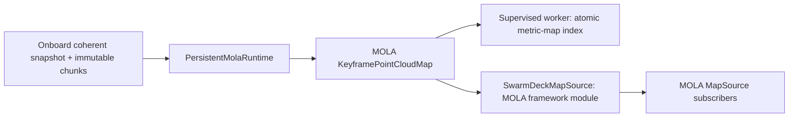

# Native MOLA runtime

The `planning-refactor` pipeline gives MOLA persistent ownership of corrected
point geometry. Swarm-SLAM remains the pose-graph authority. MOLA neither runs a
second optimizer for these maps nor publishes another `map → odom` transform.

Two consumers use the same C++ runtime:



This is a **point-geometry layer**, not a free-space or terrain representation.
The existing indexed-map service and MGG OctoMap remain separate. Connecting
MOLA map products to planning requires the occupancy and observation-provenance
checks in the [remaining integration plan](../architecture/planning-refactor-remaining.md).

## Worker deployment

Build `deploy/docker/Dockerfile.mapping` and use either the simulation
`docker-compose.mapping.yml` overlay or the robot-local `peer_mola_mapping`
service. Both require the active `SWARMDECK_MISSION_ID`; old missions on the map
volume are not selected implicitly. Commands are in the
[integration guide](decentralized-autonomy.md).

The default worker maintains one `swarmdeck-mola-import --serve` subprocess.
It imports each component independently, then atomically publishes a whole-peer
`mola/index.json` only when the source still matches. Unchanged component
artifacts are reused after checking their size and SHA-256. Pose-only revisions
reuse resident keyframe geometry; replacement and retraction build a coherent
new map. Published map objects remain immutable.

The subprocess protocol has a versioned ready event, correlated requests,
explicit `replace` and `pose_only` modes, and checked revision/artifact responses.
Timeout, process death, malformed output, and source races invalidate resident
state. A later request can rebuild from immutable chunks. There is no silent
fallback to the legacy importer; `--mode oneshot` selects that compatibility
path explicitly. Removing a component releases its resident context.

| Limit | Default |
| --- | --- |
| Snapshot JSON | 4 MiB |
| JSONL request / response | 64 KiB each |
| Submaps / chunks per component | 4,096 / 16,384 |
| Points per component | 2,000,000 |
| Runtime points, including a replacement candidate | 8,000,000 |
| Resident component contexts | 256 |
| Standalone native serialized artifact | 1 GiB |
| Deployment native artifact / publication limit | 256 MiB |
| Deployment import deadline / poll / retry | 30 s / 1 s / 5 s |

These point limits account for maps owned by the runtime. Framework subscribers
can retain older immutable snapshots, so they must bound their own history.
The artifact byte limit is checked after serialization and before publication;
it is not a filesystem quota. The worker forwards its point, context and output
limits to the native process and checks the advertised effective limits. Worker
and native CLI resource flags can override their defaults.

## MOLA framework module

`swarmdeck_mola` builds `libmola_swarmdeck.so`, containing the registered
`swarmdeck_mola::SwarmDeckMapSource` module. It implements MOLA's `ExecutableBase`
and `MapSourceBase`, allowing launcher discovery and normal framework service
lookup rather than requiring a standalone import process.

Set `MOLA_MODULES_LIB_PATH` to the installed `swarmdeck_mola/lib` directory. The
mapping image sets this automatically. The installed
`share/swarmdeck_mola/config/external-map.yaml` provides a launcher configuration.
Its parameters are:

- `snapshot_file`: the coherent onboard snapshot.
- `component_id`: component to select from a whole-peer snapshot; omit only when
  the file contains exactly one manifest.
- `chunks_dir`: directory containing its immutable SHA-256-addressed chunks.
- `poll_s`: source polling interval, default 1 second.
- `max_points`: component point budget, default 2,000,000.
- `artifact_file`: optional atomic serialized output; omit for in-memory use.

The module publishes one named map layer with canonical manifest metadata,
source identity and availability. It suppresses unchanged revisions, checks the
source again before publication, and retracts the layer on invalid input or
shutdown. A valid source restores it. Repeated failures use bounded retry
backoff; a changed source can retry immediately. Late subscribers receive the
current layer rather than a history of old maps.

The module can read the same whole-peer file as the worker, with one module
instance per selected component. An unrelated component change does not reload
its geometry. A missing or ambiguous selection retracts the layer. The module
is pinned to one component identity for its lifetime; automatic reassignment
across component merges remains a lifecycle integration task.

## Validation

The Docker build executes native bridge, chunk-validation and persistent-runtime
tests, loads the actual module through the MOLA launcher factory, and runs a
Python-store fixture through both the JSONL and framework paths. For pose-only
checks, the chunk directory is removed temporarily: success therefore requires
resident geometry reuse. Tests also cover stale/conflicting revisions, immutable
held maps, geometry retraction, artifact failure, callback inspection, source
invalidation and recovery.

Worker tests exercise child death, timeout, malformed/oversized replies,
file-descriptor cleanup, cache recovery, artifact verification, mission
selection and atomic index publication. See
`autonomy/tests/test_mapping_worker.py` and the reusable scripts in
`tests/deployment/`.

The build also runs the actual `mola-cli` scheduler with the installed YAML
configuration and environment-variable expansion, verifies a newly created
artifact, and shuts the launcher down. The separate remote acceptance script
verifies a whole worker generation and its correction with chunk payloads
removed, while checking that exactly one native subprocess remains.

```bash
IMAGE=swarmdeck-mapping:mola-runtime-review \
  bash tests/deployment/mola_remote_acceptance.sh
```

Set `REMOTE` for a different workstation. To build first, set `SOURCE` to an
explicit clean source export on that workstation. All acceptance containers use
temporary map data and have networking disabled.

### Workstation measurements, September 10, 2026

On `benchbot.yannbouteiller.com`, a Release build using MOLA 2.9.0 processed
20 pose corrections of a deterministic 100,000-point cloud in one process.
Including serialized output, median correction latency was **30.0 ms**
(maximum 35.6 ms), compared with **163.8 ms** for five full one-shot imports.
Native RSS ranged from a first sample of 71.1 MiB to a final 65.0 MiB; the
maximum sampled RSS was 71.1 MiB. This fixture demonstrates reuse and startup
cost savings, not a worst-case latency or long-duration memory guarantee.

Reproduce the benchmark with the repository on `PYTHONPATH` and the native
importer's installed path:

```bash
PYTHONPATH=. python3 tests/deployment/mola_benchmark.py \
  --binary /mapping_ws/install/swarmdeck_mapping/bin/swarmdeck-mola-import
```

A read-only copy of the stopped Bistro fleet's four peer maps also imported
successfully through the persistent worker: 991,344 points in 0.83 seconds,
with four coherent artifact indexes. Individual maps held 214,959, 28,946,
71,213 and 676,226 points. This validates the real map-store format; it does
not resolve R1's limited exploration or qualify moving-robot terrain planning.

The tested image is `swarmdeck-mapping:mola-runtime-review`, image ID
`sha256:9868a7a0a4e74c85f25c22ae756c5123032013fece4f27a1c514ebfc5fb1d337`.
It is running as `planning-mapping-1` in the isolated workstation project, on
mission `92028a23-d1d1-45b8-8d0b-509815e35950`. All four live artifact indexes
match their source snapshot SHA-256 and one native process serves them. The
simulator, MGG, peer SLAM and production deployment were not restarted.
