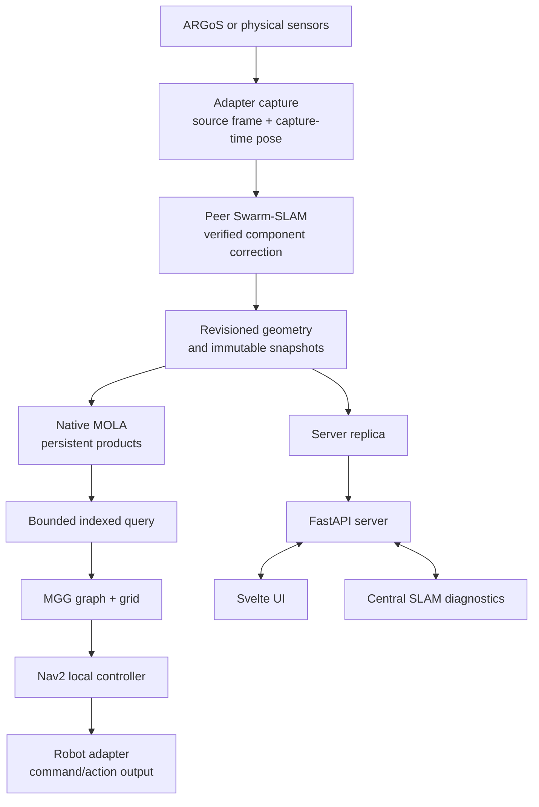

# SwarmDeck plan: peer Swarm-SLAM, native MOLA, MGG planning

This is the single plan for the `planning-refactor` work: the architecture, the
invariants, what is done, what is open, and how to validate it. Dated trials and
their numbers are in the [acceptance log](operations/acceptance-log.md).
Superseded design, tracker and chronology documents are kept unchanged in
[the archive](archive/README.md).

## Architecture

Every robot runs the whole onboard chain. Robots collaborate directly when
connected. The server receives replicated results for supervision; it is not
required to compute their maps or routes.



The planning hierarchy is graph planner, then grid planner, then local
trajectory planner and controller. Exploration and coordination influence
planning objectives; collision, terrain feasibility and actuator limits remain
hard constraints.

### Ownership

| Concern | Authority | Source |
| --- | --- | --- |
| Continuous local motion estimate | One selected odometry frontend per robot and session | `adapters/`, estimator containers |
| Collaborative keyframe poses and component membership | Peer Swarm-SLAM solution adapter | `deploy/cslam/`, `deploy/autonomy/` |
| Occupancy, surface geometry, map revisions | Native MOLA mapper | `swarmdeck_ros/src/swarmdeck_mapping/` |
| Snapshot contracts, coordination, indexed map queries | Peer mapping layer | `autonomy/`, `deploy/autonomy/` |
| Robot feasibility | Shared traversal model, used by both planners and the controller | `deploy/mgg/` |
| Exploration routes and navigation goals | MGG graph and grid planning | `deploy/mgg/` |
| Actuator commands and cancellation | Onboard command arbiter in the adapter | `adapters/` |
| Gaussian appearance and checkpoints | Optional reconstruction worker, bound to a graph revision | `scripts/reconstruction/` |
| Fleet state, sessions, replicas, operator commands | ROS-free server | `server/` |
| Operator display | Cached replica in the browser | `ui/` |
| Server-facing pose graph and occupancy diagnostics | Central SLAM service on `:8090` | `slam/` |

Adapters capture points in a sensor frame and associate them with the pose at
the capture timestamp. Local odometry and navigation frames stay robot-owned.
Peer Swarm-SLAM can establish a verified component frame and correction. The
same correction identity and map revision flow into the MOLA product and the
indexed query. MGG plans in the configured robot navigation frame, Nav2 handles
local obstacle avoidance, and the adapter owns the final command boundary.

MGG is built from the `swarmdeck` branch of
[MGGPlanner](https://github.com/MISTLab/MGGPlanner), currently pinned at commit
`b153e639a1778bb747f32c29a5804fe4fc03677b` (59 commits over upstream
`902e868`), selected by `MGG_REV` in `deploy/docker/Dockerfile.mgg`. Planner
changes are made in that repository and the pin is advanced.
`deploy/docker/build-mgg-msgs.sh` builds only `mgg_msgs` from the same pin, so
service type hashes match across images.

## Invariants

These rules are non-negotiable. A failing trial is not a reason to weaken one.

1. One provider publishes local odometry per robot and session. Multiple
   estimators consuming the same IMU and LiDAR are not independent measurements.
2. Peer Swarm-SLAM is the only corrected-pose authority. MOLA neither optimizes
   those poses nor publishes a competing `map -> odom` transform.
3. No identity transform connects unverified components. A disconnected robot
   has its own map root; a missing or stale shared transform blocks the
   dependent operation instead of assuming two local frames coincide.
4. Occupied points alone cannot certify free space. Free space requires explicit
   `RayEvidence`: `FIRST_RETURN`, `DESKEWED` or `NOT_REQUIRED`, plus
   `SINGLE_CAPTURE`. Missing, partial, stale or generic geometry evidence never
   creates free space.
5. Unknown stays unknown. Unknown ground and missing returns are not
   traversable, omitted rays never become inferred free space, and obstacle
   expiry alone cannot prove an area clear.
6. Gaussian opacity is not occupancy probability, and absence of splats is not
   observed free space. Gaussian output never reaches collision planning.
7. Stop, a replacement goal and link loss win over every late path or service
   response. Physical or local stop always overrides planning.
8. Never claim Stop All was delivered to an unreachable robot. Show pending or
   unconfirmed status and use mission generations to reject stale commands.
9. Hardware adapters never advertise or implement the simulation-only `reset`
   capability.
10. A distant goal is never silently replaced with a nearby proxy. A response
    claiming a complete route must end within 1 mm of the requested
    navigation-frame XY; supported terrain may change endpoint height.
11. A route binds to the geometry it was checked against. Revision increments
    alone are not physical frame changes; material corrections revalidate or
    replan the same destination.
12. A local empty frontier set is not fleet completion. Distinguish `blocked`,
    `waiting_for_map`, `locally_exhausted` and `complete`.
13. The server is a replica. It does not solve a robot's graph or issue map
    corrections in decentralized mode, and robots must not depend on pulling a
    server grid back to continue planning.
14. The backend and the browser stay ROS-free. Planner and middleware details
    stay inside adapters.
15. Selecting a backend that has no valid product returns unavailable. There is
    no silent fallback to a coarser map, to raw clouds, or to a relabelled frame.
16. A coarse voxel index cannot enforce a fine step limit. The exact surface
    query is the safety gate; 0.20 m voxel centres do not resolve a 0.15 m step.
17. Simulation terrain step settings are 0.15 m for Bunker and Scout and 0.30 m
    for Spot. These are simulator parameters, not hardware guarantees.
18. Simulation ground truth is used only for scoring, never as an inter-robot
    alignment source or a planner input.

## Status

| Priority | Deliverable | State | Evidence |
| --- | --- | --- | --- |
| 1 | Persistent native MOLA map ownership and a loadable MOLA framework module | Done | 2026-09-10 workstation correction benchmark; 2026-09-15 Bistro replay |
| 2 | MOLA map products behind the planner map-provider interface, with explicit free, occupied and unknown terrain semantics | Sim only | 2026-09-10 four-robot native free-space production; the native grid is the simulation default and hardware use is unqualified |
| 3 | Selectable calibrated odometry and capture providers for simulation, SuperOdometry and FAST-LIVO2 | Partial | 2026-09-15 Fast-LIVO2 mission on domain 219; SuperOdometry and FAST-LIVO2 capture contracts remain occupied-only |
| 4 | Shared graph, grid and local-control planning for Explore, Navigate and Home, with blocked-corridor replanning and speed limits | Partial | 2026-09-16 `c31425e` four-robot Bistro exploration; blocked-edge exclusion and speed limits are not implemented |
| 5 | Qualify peer SLAM and exploration coordination on Bistro and on separate hosts | Partial | verified multi-robot components observed in the replica catalogue; no multi-host, partition or optimizer-loss trial |
| 6 | Qualify per-robot gateways, ARM builds and physical ROS 2 deployment | Not started | no ARM build, packet capture or hardware motion trial is recorded |
| Parallel | Fixed-pose Gaussian batch reconstruction, then incremental training | Partial | native CUDA smoke completed nine optimizer iterations and converted 540 Gaussians; no real-capture alignment measurement |

## Open work

Each item names its acceptance gate.

- [ ] **Bistro road crossing.** Gate: R0 reaches the 20 m forward road
      destination, or a measured barrier explains every rejected detour. The
      failure reproduces with synthetic drift and with Fast-LIVO2 odometry, and
      is not deadline exhaustion.
- [ ] **Fleet motion acceptance.** Gate: four-robot startup, Navigate and Home
      succeed against independent simulation truth; cancellation and map
      corrections stop or replan correctly.
- [ ] **Blocked-corridor topological replanning and speed limits.** Gate: a
      failed edge is excluded from a new topological search, and refined paths
      carry speed limits.
- [ ] **Moving obstacles and blind corners.** Gate: controlled trials where the
      local controller stops or avoids, then resumes or requests a valid
      replacement corridor.
- [ ] **Inter-robot closure accuracy and duplicate coverage.** Gate: measured
      inter-robot candidate and accepted-closure counts, a consistent shared
      component on peers and the server, and reduced duplicate coverage versus
      independent MGG.
- [ ] **Separate hosts, partitions and optimizer loss.** Gate: peers collaborate
      with the server stopped; partition and rejoin do not duplicate commands or
      falsely declare completion. A frontend restart currently requires a fresh
      fleet mission and domain; transparent restart is not implemented.
- [ ] **Hardware capture provenance.** Gate: SuperOdometry and FAST-LIVO2
      capture contracts attest first returns, deskew and one endpoint per ray,
      verified against recorded data. Until then those paths stay occupied-only.
- [ ] **Physical robot qualification.** Gate: per-platform sensor and TF
      validation, ARM images, calibration, bounded peer traffic, and low-speed
      controller trials, followed by the strict indexed terrain gate.
- [ ] **Per-robot network gateways.** Gate: packet captures show no DDS
      discovery on fleet links; required collaboration survives server and peer
      loss within measured traffic budgets.
- [ ] **Long-duration map capacity.** Gate: measure the next capacity boundary.
      The one-million-point publication limit is reached at 245 captures when
      each capture retains the configured maximum of 4,096 endpoints.
- [ ] **Gaussian reconstruction from real captures.** Gate: measured alignment,
      held-out image quality, memory, training and rendering budgets, correction
      replacement and cancellation.
- [ ] **Frontend restart persistence.** Gate: an explicit persistence or epoch
      solution for a restarted Swarm-SLAM frontend.

## Validation

```bash
# Normal simulation run: peer Swarm-SLAM, native MOLA, MGG, drift odometry
./scripts/sim-up --scenario bistro --drift
./scripts/sim-up --status
./scripts/sim-up --down

# Fleet exploration startup against a running four-robot simulation
server/.venv/bin/python tests/deployment/exploration_acceptance.py \
  --simulation --base-url http://localhost:8080 --duration 180

# Python, UI and SLAM suites
make test
make test-ui
make test-slam

# MGG native PCI contract smoke, without robot access
docker run --rm --network none -e ROS_DOMAIN_ID=173 \
  -e FASTDDS_BUILTIN_TRANSPORTS=UDPv4 -v "$PWD:/workspace:ro" -w /workspace \
  --entrypoint bash swarmdeck-mgg:local -lc '
    source /opt/ros/jazzy/setup.bash
    source /opt/mgg/ros2/install/setup.bash
    export PYTHONPATH=/workspace:"$PYTHONPATH"
    python3 adapters/test/ros/mgg_contract_smoke.py'
```

Operational detail is in [current stack operations](operations/current-stack.md),
[MGG exploration](operations/mgg-exploration.md) and the
[MOLA runtime guide](operations/mola-runtime.md). Record the source revision,
image identity, executed tests, measured limits and remaining failures for every
trial in the [acceptance log](operations/acceptance-log.md). A waiting status or
a visible map is not acceptance of autonomous navigation.
