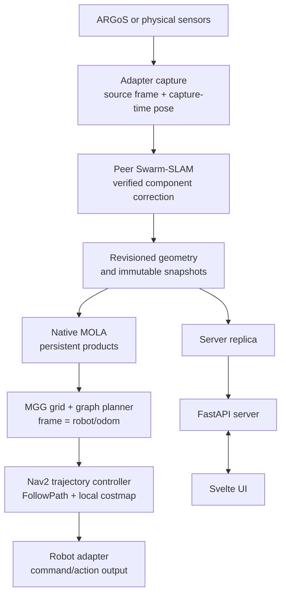

# SwarmDeck plan: peer Swarm-SLAM, native MOLA, MGG planning

This is the single plan for the `planning-refactor` work: the architecture, the
invariants, what is done, what is open, and how to validate it. Dated trials and
their numbers are in the [acceptance log](operations/acceptance-log.md).
Superseded design, tracker and chronology documents are kept unchanged in
[the archive](archive/README.md).

## Architecture

Every robot runs the whole onboard chain. Robots collaborate directly when
connected. The server receives replicated results for supervision; it is not
required to compute their maps or routes.



The planning hierarchy is MGG's grid and graph planner, then the local
trajectory controller. MGG builds a grid graph around the robot on its own
map, scores the leaves by volumetric gain and hands the whole shortest path to
the best leaf to the controller; when no leaf sees anything new it routes over
its global graph to the best frontier and hands that whole route over
(Varadharajan and Beltrame, RA-L 2025). Exploration and coordination influence
planning objectives; collision, terrain feasibility and actuator limits remain
hard constraints, enforced as edge admissibility while the graphs are built.

### Ownership

| Concern | Authority | Source |
| --- | --- | --- |
| Continuous local motion estimate | One selected odometry frontend per robot and session | `adapters/`, estimator containers |
| Collaborative keyframe poses and component membership | Peer Swarm-SLAM solution adapter | `deploy/cslam/`, `deploy/autonomy/` |
| Occupancy, surface geometry, map revisions | Native MOLA mapper | `swarmdeck_ros/src/swarmdeck_mapping/` |
| Snapshot contracts and coordination | Peer mapping layer | `autonomy/`, `deploy/autonomy/` |
| Robot feasibility | Shared traversal model, used by both planners and the controller | `deploy/mgg/` |
| Exploration routes and navigation goals | MGG graph and grid planning | `deploy/mgg/` |
| Actuator commands and cancellation | Onboard command arbiter in the adapter | `adapters/` |
| Gaussian appearance and checkpoints | Optional reconstruction worker, bound to a graph revision | `scripts/reconstruction/` |
| Fleet state, sessions, replicas, operator commands | ROS-free server | `server/` |
| Operator display | Cached replica in the browser | `ui/` |

Adapters capture points in a sensor frame and associate them with the pose at
the capture timestamp. Local odometry and navigation frames stay robot-owned.
Peer Swarm-SLAM can establish a verified component frame and correction. The
same correction identity and map revision flow into the MOLA product. The MOLA
product is self-described: the worker publishes `mola/source.json` (the exact
`snapshot.json` bytes it built from) and then `mola/index.json`, whose
`source_sha256` names those bytes, so a finished build is always published
even when the bridge has already replaced `snapshot.json`. MGG's `MolaMap`
verifies that pair and never reads `snapshot.json`; it is the only reader, and
it confirms an unchanged product by stat of that pair rather than by reloading
it. MGG plans in the configured robot navigation frame, Nav2 handles local
obstacle avoidance, and the adapter owns the final command boundary.

The product key a robot advertises on `/<robot>/map_authority` is always a
published product. The bridge reads the MOLA worker's `mola/index.json` with
its `mola/source.json` (a coherent pair: a mismatch means a publication in
progress and is retried; `snapshot.json` is never read) and advertises the
newest product, with the correction, solution order and home pose that were in
effect at the revision that product was built from
(`CslamMapper.frame_history`, `autonomy/product_authority.py`). A pose-graph
revision without a product is never advertised, so a consumer that finds the
key on disk finds geometry placed with the transform the key carries. Revision
increments alone are not frame changes (invariant 11), so routes keep executing
across product transitions.

MGG is built from the `ros2` branch of
[MGGPlanner](https://github.com/MISTLab/MGGPlanner), pinned by `MGG_REV` in
`deploy/docker/Dockerfile.mgg` (and in `Dockerfile.sim` and
`Dockerfile.robot-ros2`, which build only `mgg_msgs` from the same pin through
`deploy/docker/build-mgg-msgs.sh`, so service type hashes match across
images). No patch is applied. The `swarmdeck` branch (last pin `7004cd4`)
carried route windows, proxies, validated prefixes, continuation tokens, a 2D
corridor re-planner and an indexed map query service; on 2026-09-21 the
operator's verdict was that those had turned MGG's plans into breadcrumbs, and
the paper-neutral infrastructure was re-ported selectively onto `ros2` (the
MOLA map backend, the global graph mechanisms, PCI external execution) with
the planner node rewritten around whole plans:

- the exploration service returns the whole lattice path to the best-gain
  leaf (rrg.cpp:4357 `getBestPath`), shortcut where the map vouches for the
  straight segment and resampled at `path_interpolation_distance`; the
  accepted path and the lattice's frontier clusters join the global graph
  (`addRefPathToGraph`, `addFrontiers`);
- without a frontier among the leaves for `auto_global_planner_low_gain_rounds`
  cycles (3 in `deploy/mgg/robot.launch.py`; upstream's 15 assumed a 10 Hz
  replan loop) the global planner ranks the global frontiers by Dijkstra
  distance and gain (`searchGlobalFrontier`, rrg.cpp:5559) and returns the
  whole route to the best one, which stays the target until the robot is
  within `global_frontier_reach_m` (5 m) of it; no reachable frontier is
  exploration complete, which PCI reports as `complete`;
- `plan_objective` (Navigate, Return Home) returns the whole Dijkstra route
  over the global graph to a vertex placed at the exact goal with checked
  edges (Return Home: the root, the first odometry); an unreachable goal is
  refused, never approached by a stub;
- between cycles the roadmap grows as rrg.cpp:5247 and 2535 had it (odometry
  every 0.5 m wired to every reachable neighbour, event E1 every metre, the
  expansion timer around unvisited clusters), and both the expansion and the
  MOLA heartbeat idle while their inputs are unchanged.

Terrain (step, inclination, clearance, ground support) is judged by
`GroundProjection` over `MolaMap`'s surface records while the graphs are
built; there is no second validation of a finished route against another
decode of the same product.

Measured on Benchbot (Bistro, four robots, drift odometry) on 2026-09-21
with the port at `13c2236`: robot_0 drove 43.6 m in 180 s of Explore on 13
consecutive whole lattice paths of 4.8 to 11.0 m, each accepted and executed
(the fork's cycles were half rejected on a snapshot race and returned 6 m
lattice-boundary paths at best); the fleet moved 43.6 / 26.0 / 11.1 / 28.9 m.
Parked after the trial the whole stack takes 2.8 cores against 13.2 before
(duck detector 1.0, ARGoS 0.8, sim bridge and adapter 0.3, MGG 0.15, each
Swarm-SLAM peer 0.13, mapping 0.0).

## Invariants

These rules are non-negotiable. A failing trial is not a reason to weaken one.

1. One provider publishes local odometry per robot and session. Multiple
   estimators consuming the same IMU and LiDAR are not independent measurements.
2. Peer Swarm-SLAM is the only corrected-pose authority. MOLA neither optimizes
   those poses nor publishes a competing TF transform.
3. No identity transform connects unverified components. Corrections remain data,
   and a disconnected robot has its own map root; missing or stale shared data
   blocks the dependent operation instead of assuming local frames coincide.
4. Occupied points alone cannot certify free space. Free space requires explicit
   `RayEvidence`: `FIRST_RETURN`, `DESKEWED` or `NOT_REQUIRED`, plus
   `SINGLE_CAPTURE`. Missing, partial, stale or generic geometry evidence never
   creates free space.
5. Unknown stays unknown. Unknown ground and missing returns are not
   traversable, omitted rays never become inferred free space, and obstacle
   expiry alone cannot prove an area clear.
6. Gaussian opacity is not occupancy probability, and absence of splats is not
   observed free space. Gaussian output never reaches collision planning.
7. Stop, a replacement goal and link loss win over every late path or service
   response. Physical or local stop always overrides planning.
8. Never claim Stop All was delivered to an unreachable robot. Show pending or
   unconfirmed status and use mission generations to reject stale commands.
9. Hardware adapters never advertise or implement the simulation-only `reset`
   capability.
10. A distant goal is never silently replaced with a nearby proxy. A response
    claiming a complete route must end within 1 mm of the requested
    navigation-frame XY; supported terrain may change endpoint height.
11. A route binds to the geometry it was checked against. Revision increments
    alone are not physical frame changes; material corrections revalidate or
    replan the same destination.
12. A local empty frontier set is not fleet completion. Distinguish `blocked`,
    `waiting_for_map`, `locally_exhausted` and `complete`.
13. The server is a replica. It does not solve a robot's graph or issue map
    corrections in decentralized mode, and robots must not depend on pulling a
    server grid back to continue planning.
14. The backend and the browser stay ROS-free. Planner and middleware details
    stay inside adapters.
15. Selecting a backend that has no valid product returns unavailable. There is
    no silent fallback to a coarser map, to raw clouds, or to a relabelled frame.
16. A coarse voxel index cannot enforce a fine step limit. The product's
    surface records, read by MGG's `MolaMap`, are the safety gate; 20 cm voxel
    centres alone cannot enforce a 10 cm platform step limit.
17. Simulation terrain step settings are 0.15 m for Bunker and Scout and 0.30 m
    for Spot, with a 0.25 m drop limit for Bunker and Scout (a platform drives
    down a kerb it could not climb). These are simulator parameters, not
    hardware guarantees.
18. Simulation ground truth is used only for scoring, never as an inter-robot
    alignment source or a planner input. The one exception is the
    simulation-only peer-body mask, which reads every robot's ground-truth pose
    to delete returns that landed on a neighbour at the capture stamp; it feeds
    no pose estimate and is off on hardware. Trials that use it must say so,
    because hardware robots remain visible to each other.
19. Frontier reservations are arbitrated only between robots that share a
    frame: one verified map component, or, where a deployment has surveyed
    every robot's start pose, that deployment frame
    (`SWARMDECK_COORDINATION_FRAME=deployment`, on in simulation). The
    deployment frame carries reservation targets only, whose radius absorbs
    metres of drift; it never aligns maps, moves a pose or reaches a planner's
    geometry. Without either, robots explore independently. The same frame
    carries each robot's reported position to its peers' planners as a
    transient keep-out disc; it expires with the reports and is never stored
    in a map.

    The same surveyed frame also carries the server's deployment composite
    (`deployment:<session>`, frame `deployment`, served beside the real
    components at `/api/autonomy/replicas/components`): every replicated
    single-robot component of the active mission, each placed by
    `T_world_component = T_world_navigation(robot) @ inv(T_component_navigation(robot))`,
    where the first factor is the map service's transform for that robot (the
    surveyed start pose the 2D fleet map uses) and the second comes from the
    robot's live mapping authority. It is a display and goal-entry composition
    in the deployment frame, not a verified merge: no closure, no shared
    solution and no geometry is exchanged between members, chunks pass through
    untouched, and a robot without both a surveyed placement and a live
    authority is simply left out. The composite reports the pre-optimizer
    frame revision `(0, -1)`; each member's own frame revision still fences
    its live overlay, and a goal clicked in the composite is dispatched to the
    target robot in its own component and frame revision (the click converted
    with the inverse placement), so the robot applies the same stale-frame
    checks as for any component goal. The Global 3D view falls back to the
    composite only while no verified multi-robot component exists, and it
    never counts as merged membership. The server also rasterizes the
    composite for the 2D map (`deployment:<session>` in `/api/map/optimized`,
    0.2 m cells, ground at the 10th percentile of z, occupied between
    ground + 0.30 m and ground + 2.0 m): a display raster of the replicated
    keyframes in the surveyed deployment frame, ranked after any verified
    multi-robot component, and no planner reads the display raster.
20. Navigation frame equals the robot's continuous odometry frame. Corrections
    are data (`T_component_navigation`), never a TF edge.
21. One 3D backend is selected by `SWARMDECK_SLAM_BACKEND=cslam`: peer
    Swarm-SLAM supplies corrected poses and MOLA supplies occupancy products.
22. Nav2 is the controller only. MGG is the sole planner and sends trajectories
    to `FollowPath`.

## Status

| Priority | Deliverable | State | Evidence |
| --- | --- | --- | --- |
| 1 | Persistent native MOLA map ownership and a loadable MOLA framework module | Done | 2026-09-10 workstation correction benchmark; 2026-09-15 Bistro replay |
| 2 | MOLA map products behind the planner map-provider interface, with explicit free, occupied and unknown terrain semantics | Sim only | 2026-09-10 four-robot native free-space production; the native grid is the simulation default and hardware use is unqualified |
| 3 | Selectable calibrated odometry and capture providers for simulation, SuperOdometry and FAST-LIVO2 | Partial | 2026-09-15 Fast-LIVO2 mission on domain 219; SuperOdometry and FAST-LIVO2 capture contracts remain occupied-only |
| 4 | Shared graph, grid and local-control planning for Explore, Navigate and Home, with blocked-corridor replanning and speed limits | Partial | 2026-09-18 `e7affc8` with MGG head `3486391`: three consecutive grouped-start Fleet Explore trials passed for all four robots (15 to 40 m each) with server-sequenced departures, peer bodies as transient discs, a 0.9 s planner and the route-progress watchdog; speed limits are not implemented |
| 5 | Qualify peer SLAM and exploration coordination on Bistro and on separate hosts | Partial | 2026-09-16 live merges are geometrically wrong in Z (about 0.3 m between platforms) and break terrain gates; merges are disabled again on benchbot; no multi-host, partition or optimizer-loss trial |
| 6 | Qualify per-robot gateways, ARM builds and physical ROS 2 deployment | Not started | no ARM build, packet capture or hardware motion trial is recorded |
| Parallel | Fixed-pose Gaussian batch reconstruction, then incremental training | Partial | native CUDA smoke completed nine optimizer iterations and converted 540 Gaussians; no real-capture alignment measurement |

## Open work

Each item names its acceptance gate.

- [ ] **Bistro road crossing.** Gate: R0 reaches the 20 m forward road
      destination, or a measured barrier explains every rejected detour. The
      failure reproduces with synthetic drift and with Fast-LIVO2 odometry, and
      is not deadline exhaustion.
- [ ] **Fleet motion acceptance.** Gate: four-robot startup, Navigate and Home
      succeed against independent simulation truth; cancellation and map
      corrections stop or replan correctly. The measurements below are from
      the `swarmdeck` branch's sectioned routes and predate the `ros2` port;
      they have to be repeated with whole routes. Benchbot: one cycle passed 3 m Navigate for all four; the final cycle
      passed R0/R2/R3 while R1 refused an over-bound provisional connector.
      Final 8 m road goals passed for R0/R1; Scout stopped after a measured
      0.581 m rise and Spot refused a measured 1.266–1.573 m drop.
      The subsequent four Home legs ended 0.225–0.251 m from their initial
      independent truth positions. Scout's live-envelope check was inconclusive
      at 0.621 m despite a 0.241 m physical return error; do not report that
      harness result as a pass. Final 180 s Explore passed for all four
      (30.2 / 23.7 / 29.6 / 30.9 m navigation-frame displacement), with one
      transient HTTP 404, no authority changes, and Stop All verified.
      After Explore, long Home passed for R1/R3/R0 in 71.9/112.3/111.1 s,
      with independent return errors of 0.240/0.368/0.283 m. Scout refused
      immediately outside the 1 m graph tolerance, still 29.916 m from its
      original physical position: its breadcrumb drain had blocked and later
      exploration paths could not attach to the global graph. That long-Home
      attachment failure remains open, as do repeated cold-start connector
      refusal and terrain/road-boundary cases. Do not relax safety limits to
      turn these refusals into nominal passes.
- [ ] **Blocked-corridor topological replanning and speed limits.** Gate: a
      failed edge is excluded from a new topological search, and refined paths
      carry speed limits. Implemented in MGG at `494ce66` (branch head `c4eff1b`): Explore now runs
      through the shared topological and grid stages, and a bounded, expiring
      blocked-corridor registry (64 entries, 10 s, 8 map revisions) steers the
      topological search for all three objectives; native tests grew from 319
      to 340 entries. Not yet pinned in `Dockerfile.mgg` because it changes the
      live exploration path (refined corridor polylines instead of the
      shortcut walk, and Explore can now be refused on terrain). Advance
      `MGG_REV` after one fresh Bistro exploration trial. Speed limits remain
      unimplemented; `queryIndexedMap` refuses height refinement and prefix
      truncation whenever speed limits are present, which must be resolved
      first.
- [ ] **Cold-start Navigate beyond the first ground ring.** Was measured on
      the `swarmdeck` branch's validated-prefix sections (2026-09-17: 16 of 18
      goals at 3 m within 0.32 m). Those sections are gone; on the `ros2` port
      a goal beyond the mapped ground is refused until the roadmap reaches it.
      Gate: re-measure with whole routes; scene-change keyframes for parked
      robots stay.
- [x] **Peers as live obstacles for the global route.** Done 2026-09-17: each
      robot reports its position in the surveyed deployment frame and its
      peers' planners hold a 0.7 m transient disc around it (MGG `004c517`);
      with server-sequenced departures and the route watchdog, three grouped
      starts in a row passed on 2026-09-18. Earlier notes follow.
      Original gate text: Phantom bodies of
      robots that have left are now retired by visibility (three later
      qualified rays through the voxel); present neighbours remain an open
      gate. Gate: at a grouped
      Bistro start, exploration routes avoid neighbouring robots and no robot
      ends in Nav2 `Failed to make progress` against a peer. The capture-time
      peer-body mask keeps robots out of the persistent map, so MGG's route
      no longer sees them while Nav2's live costmap still does; feed each
      peer's current position and body radius to MGG as a temporary exclusion
      (simulation adapter first, then the intentions channel for hardware).
      Measured 2026-09-17: this is what breaks Fleet Explore from the grouped
      start. First paths run through parked neighbours, the local controller
      improvises outside the validated corridor, and robots wedge beside a
      0.19 m kerb at (-9.7, 3.3) and near (-11.6, 7.6) in the simulation frame.
      Limiting reverse to 0.15 m/s made one grouped start pass and did not
      cure the next; Explore from dispersed poses passes (25 to 33 m each).
      Also find out why a route MGG admits beside that kerb is not drivable.
      Keyframe bursts during recovery motion are explained (2026-09-17):
      robot_2's 121 keyframes in three minutes on 2026-09-16 predate the
      scene-change rule and come from the distance rule alone, which
      compares against the last keyframe's position only, has no rotation
      term, and so pays one keyframe per swing whenever recovery rocks the
      robot by more than 0.25 m. With the scene-change rule live, robot_3 in
      mission `a72b1c3d` added a keyframe every 5.0 to 5.8 s for 160 s while
      dithering inside 0.7 m by 0.4 m with 5 to 39 degree yaw swings (27 of
      51 steps under 0.2 m): the azimuth signature was binned in the sensor
      frame, and on a stored keyframe a pure 5 degree yaw moved four of 72
      sectors by more than 0.5 m. The patch now bins in the odometry frame
      (yaw-aligned); verify on the next rebuilt cslam image that a rocking
      robot's keyframe count tracks its distance again.
- [ ] **Moving obstacles and blind corners.** Gate: controlled trials where the
      local controller stops or avoids, then resumes or requests a valid
      replacement corridor.
- [ ] **Inter-robot closure accuracy and duplicate coverage.** Gate: measured
      inter-robot candidate and accepted-closure counts, a consistent shared
      component on peers and the server, and reduced duplicate coverage versus
      independent MGG. Offline replay (2026-09-16) links all six robot pairs
      with zero false merges after the peer admission change (similarity 0.70,
      18 inliers, ICP overlap gate 0.40). Live on 2026-09-16 the fleet merged
      within seconds and XY and yaw matched ground truth within 6 mm and 0.01
      degrees, but vertical placement between platforms with different lidar
      heights was off by about 0.3 m and pairwise errors grew to 0.45 to
      0.83 m in XY after 20 m of drift-odometry travel; the merged floors then
      failed the 0.15 m step gate everywhere and Navigate and Explore stopped
      working. The deployed override runs the strict no-merge cslam image
      again. Next: planar or ground-plane-corrected inter-robot constraints
      for ground robots, then re-measure Z before re-enabling merges.
- [ ] **Separate hosts, partitions and optimizer loss.** Gate: peers collaborate
      with the server stopped; partition and rejoin do not duplicate commands or
      falsely declare completion. A supported simulation frontend restart now
      advances only that robot's durable map epoch; partition/rejoin and
      multi-host recovery remain unqualified.
- [ ] **Hardware capture provenance.** Gate: SuperOdometry and FAST-LIVO2
      capture contracts attest first returns, deskew and one endpoint per ray,
      verified against recorded data. Until then those paths stay occupied-only.
- [ ] **Physical robot qualification.** Gate: per-platform sensor and TF
      validation, ARM images, calibration, bounded peer traffic, and low-speed
      controller trials, followed by the strict terrain gate.
- [ ] **Per-robot network gateways.** Gate: packet captures show no DDS
      discovery on fleet links; required collaboration survives server and peer
      loss within measured traffic budgets.
- [ ] **Long-duration map capacity.** Gate: measure when a long mission reaches
      the MOLA product bounds (`map.mola.max_voxels` 2,000,000, 256 MiB of
      grid, `map.mola.max_load_ms`) and what the planner does past them;
      exceeding a bound currently leaves the planner without a map.
- [ ] **Gaussian reconstruction from real captures.** Gate: measured alignment,
      held-out image quality, memory, training and rendering budgets, correction
      replacement and cancellation.
- [x] **Reproducible Jazzy images.** The ROS dependency layers no longer depend
      on historical Docker cache anchors. `use-ros-snapshot.sh` selects the
      signed Jazzy 2026-06-18 snapshot, removes mutable ROS apt sources, and
      permits downgrade of newer ROS packages inherited from the base image.
      Fresh sim, mapping, MGG and cslam builds passed on Benchbot amd64 with
      MOLA 2.9.0, Nav2 1.3.12 and tf2 0.36.21. Native lifecycle bring-up,
      lost-reply reconciliation and SIGINT shutdown passed.
      Humble uses its signed 2026-07-02 snapshot. Ubuntu updates, base-image
      tags and Python dependencies are not a bit-for-bit hermetic OS lock;
      hardware and ARM image qualification remain separate gates.
- [x] **Per-robot map clear without a fleet restart (robot map epoch).**
      `POST /api/map/reset/{robot}?request_id=<UUID>` quiesces the target and
      restarts its peer frontend, bridge, MOLA worker and MGG state under a
      fresh durable epoch, then clears costmaps and waits for fresh authority.
      Only the target's old geometry, descriptors, graph references, closures
      and pair-cap state are retired; unrelated peers keep their own maps,
      runs and fleet mission. Native messages, in-flight optimizer results,
      replica uploads, MOLA products and moving commands are epoch-fenced.
      `KeyframeId.session_id` carries the robot run UUID; the replica envelope's
      `session_id` remains the fleet mission. Return Home uses the new run's
      initial keyframe at the reset location, unless a surveyed home is set.
      Benchbot manual clears completed in 20.4–24.1 s, including a genuinely
      merged four-peer component. Old target anchors disappeared from all
      three peers; their own keyframes remained. Replayed stale replicas
      received HTTP 409, UUID retries returned the original completed result,
      and the actual UI disabled Reset while pending and restored it on done.
      Reset during active Explore also passed: R0 alone advanced its epoch
      and returned ready/idle in 24.1 s; independent truth measured at most
      1.65 cm XY displacement from quiescence through ten seconds after done.
      The supported path is the native four-robot simulation supervisor;
      hardware without a qualified robot-local supervisor fails closed.
- [x] **Frontend restart persistence.** The durable epoch solution is active.
      A direct restart of one merged simulation peer advanced epoch 1 to 2
      and restored navigation-ready authority in 16.4 s without changing the
      mission or the other peers' runs. Retired epoch watermarks survive
      process restart; abandoned destructive source operations are not replayed
      ambiguously under the same request.

## Validation

```bash
# Normal simulation run: peer Swarm-SLAM, native MOLA, MGG, drift odometry
./scripts/sim-up --scenario bistro --drift
./scripts/sim-up --status
./scripts/sim-up --down

# Fleet exploration startup against a running four-robot simulation
server/.venv/bin/python tests/deployment/exploration_acceptance.py \
  --simulation --base-url http://localhost:8080 --duration 180

# Python and UI suites
make test
make test-ui

# MGG native PCI contract smoke, without robot access
docker run --rm --network none -e ROS_DOMAIN_ID=173 \
  -e FASTDDS_BUILTIN_TRANSPORTS=UDPv4 -v "$PWD:/workspace:ro" -w /workspace \
  --entrypoint bash swarmdeck-mgg:local -lc '
    source /opt/ros/jazzy/setup.bash
    source /opt/mgg/ros2/install/setup.bash
    export PYTHONPATH=/workspace:"$PYTHONPATH"
    python3 adapters/test/ros/mgg_contract_smoke.py'
```

Operational detail is in [current stack operations](operations/current-stack.md),
[MGG exploration](operations/mgg-exploration.md) and the
[MOLA runtime guide](operations/mola-runtime.md). Record the source revision,
image identity, executed tests, measured limits and remaining failures for every
trial in the [acceptance log](operations/acceptance-log.md). A waiting status or
a visible map is not acceptance of autonomous navigation.
